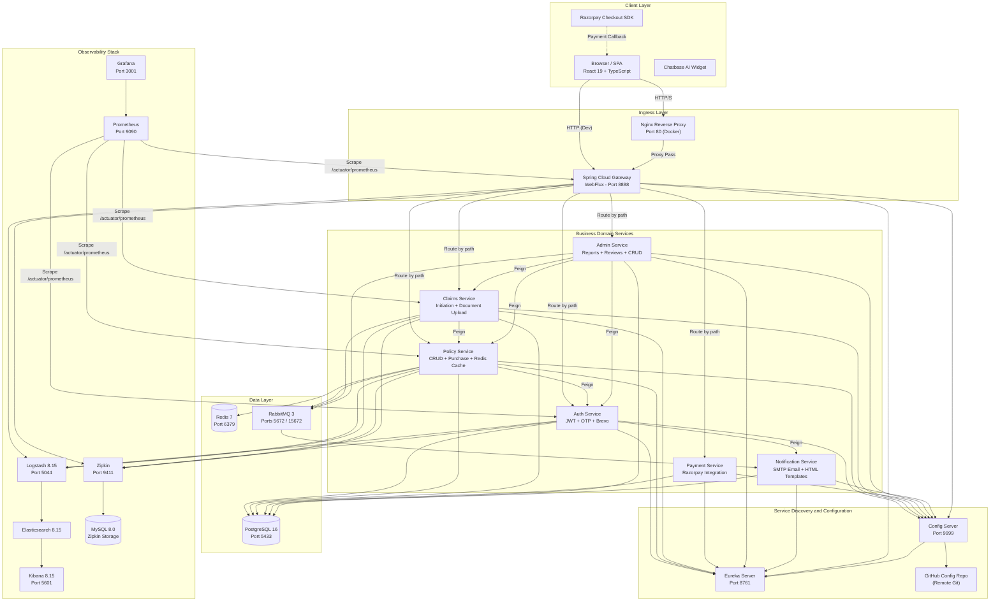
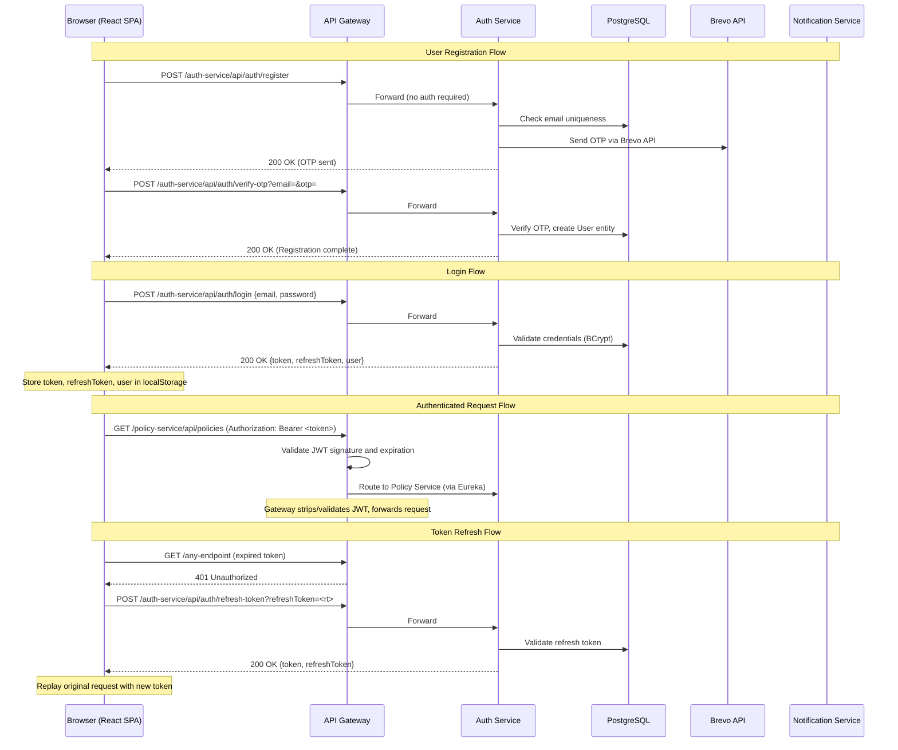
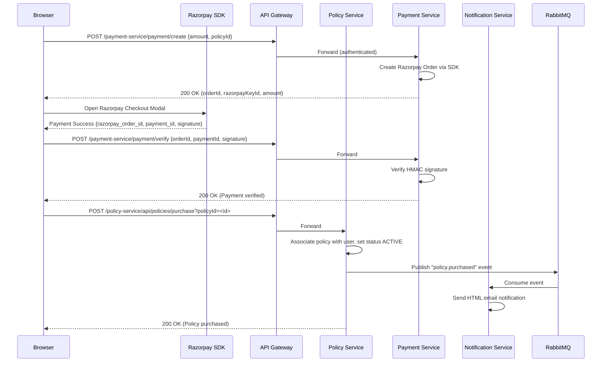

<div align="center">

# SmartSure Insurance Management System

**Enterprise-Grade, Cloud-Native Insurance Platform**


---

A full-stack, microservices-based insurance management platform engineered with Spring Cloud and React. SmartSure provides end-to-end policy lifecycle management, claims processing, integrated payment handling via Razorpay, and a complete observability stack powered by ELK, Zipkin, Prometheus, and Grafana.

</div>

---

## Table of Contents

1. [Executive Summary](#1-executive-summary)
2. [System Architecture](#2-system-architecture)
3. [Technology Stack and External Tools](#3-technology-stack-and-external-tools)
4. [Frontend Architecture](#4-frontend-architecture)
5. [Backend Architecture](#5-backend-architecture)
6. [Data Flow and Integration](#6-data-flow-and-integration)
7. [Local Setup and Execution](#7-local-setup-and-execution)

---

## 1. Executive Summary

SmartSure is an enterprise-grade Insurance Management System designed to digitize the complete lifecycle of insurance operations. The platform serves two distinct user personas -- **Customers** who browse, purchase, and manage insurance policies, and **Administrators** who oversee policy catalogs, review claims, and generate operational reports.

The system is architected as a distributed microservices ecosystem, where each bounded context (authentication, policy management, claims processing, payments, notifications, and administration) is isolated into its own independently deployable Spring Boot service. These services communicate through a combination of synchronous REST calls brokered via Spring Cloud OpenFeign and asynchronous event-driven messaging powered by RabbitMQ. Service discovery is handled by Netflix Eureka, and externalized configuration is sourced from a dedicated Spring Cloud Config Server backed by a remote Git repository.

The frontend is a single-page application built with React 19, TypeScript, and Tailwind CSS v4. It communicates exclusively with the backend through the Spring Cloud Gateway, which acts as the sole ingress point for all client traffic. The gateway performs JWT-based authentication validation and dynamically routes requests to the appropriate downstream microservice using Eureka-resolved service identifiers.

### Primary Feature Set

- **User Authentication**: Registration with email OTP verification via the Brevo API, JWT-based login with refresh token rotation, and a secure password reset flow.
- **Policy Browsing and Purchase**: Customers can explore a catalog of insurance policies, view detailed terms and coverage, and purchase policies through an integrated Razorpay checkout.
- **Policy Lifecycle Management**: Active policies can be viewed, premiums can be paid, and cancellation requests can be submitted by customers and approved by administrators.
- **Claims Processing**: Customers initiate claims against their active policies, upload supporting documents, and track claim status through a defined review workflow.
- **Admin Operations**: Administrators have a dedicated dashboard for creating, updating, and deleting policy offerings, reviewing and adjudicating claims, managing user accounts, and generating aggregate reports.
- **Notifications**: Transactional email notifications are dispatched for key lifecycle events (policy purchase, cancellation, premium payment, claim submission, claim review) using Gmail SMTP with professionally designed HTML templates.
- **Observability**: Full-stack observability is achieved through centralized logging (ELK Stack), distributed tracing (Zipkin with MySQL persistence), and metrics collection and visualization (Prometheus + Grafana).

---

## 2. System Architecture

SmartSure follows a canonical microservices architecture pattern with a clear separation between infrastructure services (Eureka, Config Server), the API Gateway, business domain services, and supporting infrastructure (databases, message brokers, observability tools).

The architectural decisions are driven by several key principles. First, **service autonomy**: each microservice owns its domain logic and can be developed, tested, and deployed independently. Second, **infrastructure externalization**: configuration is not baked into service artifacts but is fetched at runtime from Fig Server, enabling environment-specific overrides without recompilation. Third, **resilience through asynchronous communication**: critical cross-service operations like email notifications use RabbitMQ message queues, ensuring that a downstream service failure does not cascade and block the primary request path. Fourth, **observability by default**: every service is instrumented with Micrometer metrics exported to Prometheus, structured JSON logging shipped to the ELK stack via Logstash, and distributed trace propagation via OpenTelemetry exported to Zipkin.

### High-Level System Architecture Diagram



### Network Topology

The Docker Compose deployment defines two distinct bridge networks to enforce network segmentation:

| Network | Name | Purpose |
|---------|------|---------|
| `private-network` | `smartsure-private` | Internal communication between all services, databases, and message brokers. No external exposure. |
| `proxy-network` | `smartsure-proxy` | Shared by publicly-accessible services (Frontend, API Gateway, Eureka, Kibana, Zipkin, Grafana) to enable ingress from the host machine. |

---

## 3. Technology Stack and External Tools

### Backend Stack

| Component | Technology | Version | Purpose |
|-----------|-----------|---------|---------|
|  | Spring Boot | 3.5.13 | Core application framework for all microservices providing auto-configuration, embedded server, and dependency injection. |
|  | Spring Cloud | 2025.0.1 | Distributed systems toolkit providing service discovery, centralized configuration, and API gateway capabilities. |
|  | Spring Security | 6.x | Authentication and authorization framework used for JWT filter chains and endpoint-level access control. |
|  | Java (OpenJDK) | 17 LTS | Runtime platform for all backend services. Chosen for long-term support and modern language features. |
|  | PostgreSQL | 16 Alpine | Primary relational database for all domain services. Single shared instance with service-scoped schemas. |
|  | Redis | 7 Alpine | In-memory cache used by the Policy Service for frequently accessed policy data. |
|  | RabbitMQ | 3 Management Alpine | Asynchronous message broker for decoupled event-driven communication, primarily for notification dispatch. |
|  | Apache Maven | 3.9 | Build automation and dependency management tool for all Java services. |
|  | JJWT | 0.11.5 | JSON Web Token library for issuing, parsing, and validating JWTs across all secured services. |
|  | Razorpay Java SDK | 1.4.6 | Server-side payment order creation and signature verification for the Payment Service. |
|  | SpringDoc OpenAPI | 2.8.16 | Auto-generates Swagger UI and OpenAPI 3.0 specifications for each service's REST endpoints. |
|  | Netflix Eureka | (via Spring Cloud) | Service registry enabling dynamic service discovery without hardcoded hostnames. |
|  | Spring Cloud OpenFeign | (via Spring Cloud) | Declarative HTTP client for synchronous inter-service communication using Eureka-resolved endpoints. |

### Frontend Stack

| Component | Technology | Version | Purpose |
|-----------|-----------|---------|---------|
|  | React | 19.2.4 | Core UI library for building the component-driven single-page application. |
|  | TypeScript | 6.0.2 | Statically-typed superset of JavaScript providing compile-time safety across the entire frontend codebase. |
|  | Vite | 8.0.1 | Next-generation build tool providing sub-second HMR and optimized production bundling via Rollup. |
|  | Tailwind CSS | 4.2.2 | Utility-first CSS framework with CSS-first configuration and custom design tokens for theming. |
|  | Redux Toolkit | 2.11.2 | Centralized state management for authentication state and theme preferences. |
|  | React Router DOM | 7.13.1 | Client-side routing with nested layouts, protected routes, and lazy-loaded code splitting. |
|  | Axios | 1.13.6 | HTTP client with request/response interceptors for automatic JWT attachment and token refresh. |
|  | Framer Motion | 11.18.2 | Production-quality animation library for page transitions, component mount/unmount animations. |
|  | React Hook Form | 7.72.0 | Performant form management with uncontrolled components and minimal re-renders. |
|  | Zod | 4.3.6 | Schema-based validation library integrated with React Hook Form via `@hookform/resolvers`. |
|  | React Hot Toast | 2.6.0 | Notification toast library for success, error, and informational feedback to the user. |
|  | React Icons | 5.6.0 | Consolidated icon library providing access to Font Awesome, Heroicons, and Material Design icons. |

### Observability and DevOps

| Component | Technology | Version | Purpose |
|-----------|-----------|---------|---------|
|  | Elasticsearch | 8.15.0 | Distributed search and analytics engine serving as the log storage backend for the ELK stack. |
|  | Logstash | 8.15.0 | Log ingestion pipeline receiving structured JSON logs from services via TCP appender on port 5044. |
|  | Kibana | 8.15.0 | Visualization dashboard for querying and exploring centralized logs in Elasticsearch. |
|  | Zipkin | Latest | Distributed tracing system collecting trace spans from all instrumented services. |
|  | Prometheus | Latest | Time-series metrics database scraping `/actuator/prometheus` endpoints from all services. |
|  | Grafana | Latest | Metrics visualization and alerting dashboard connected to Prometheus as its data source. |
|  | Docker / Docker Compose | 3.8 (Compose Spec) | Containerization platform and orchestration for the full 17-container deployment. |
|  | Nginx | 1.27 Alpine | Production web server for the React SPA with reverse proxy rules routing API calls to the Gateway. |

### External Services

| Service | Purpose |
|---------|---------|
| **Razorpay** | Payment gateway providing order creation, checkout UI (client-side SDK), and server-side signature verification for premium payments and policy purchases. |
| **Brevo (Sendinblue)** | Transactional email API used by the Auth Service for sending OTP codes during registration and password reset workflows. |
| **Gmail SMTP** | SMTP relay used by the Notification Service for dispatching HTML-formatted transactional emails for policy and claims lifecycle events. |
| **GitHub (Config Repository)** | Remote Git repository hosting externalized configuration files (`application.properties`) for all microservices, pulled by the Config Server at startup. |
| **Chatbase** | AI-powered chatbot widget embedded in the frontend for automated customer support. |

---

## 4. Frontend Architecture

### Project Structure

The frontend follows a **feature-first** modular architecture. Each feature module encapsulates its own components, store slices, and service calls, promoting high cohesion and low coupling between modules.

```
frontend/
|-- src/
|   |-- App.tsx                     # Root component with route definitions
|   |-- main.tsx                    # Application entry point (React root, providers)
|   |-- vite-env.d.ts               # Vite environment type declarations
|   |-- core/                       # Cross-cutting infrastructure
|   |   |-- api/
|   |   |   |-- axiosInstance.ts    # Low-level Axios instance with interceptors
|   |   |-- error-handling/
|   |   |   |-- GlobalErrorBoundary.tsx  # React Error Boundary component
|   |   |-- guards/
|   |   |   |-- ProtectedRoute.tsx  # Role-based route protection (ADMIN/CUSTOMER)
|   |   |-- services/
|   |       |-- api.ts              # Centralized API service layer (authAPI, policyAPI, etc.)
|   |-- features/                   # Feature modules
|   |   |-- admin/                  # Admin dashboard, policies, subscriptions, claims, reports
|   |   |-- auth/                   # Login, Register, ForgotPassword, authSlice
|   |   |-- claims/                 # MyClaims view
|   |   |-- dashboard/              # Customer dashboard
|   |   |-- home/                   # Landing page, About, Contact, Terms
|   |   |-- my-policies/            # Customer's active policies
|   |   |-- policies/               # Policy catalog and detail views
|   |   |-- profile/                # User profile management
|   |-- layouts/
|   |   |-- MainLayout.tsx          # Shared layout wrapper with Navbar
|   |   |-- Navbar.tsx              # Responsive navigation bar with theme toggle
|   |-- shared/
|   |   |-- components/
|   |   |   |-- UI.tsx              # Reusable UI primitives (LoadingSpinner, buttons, cards)
|   |   |-- hooks/
|   |       |-- reduxHooks.ts       # Typed useAppSelector and useAppDispatch hooks
|   |-- store/
|   |   |-- index.ts                # Redux store configuration (auth + theme reducers)
|   |   |-- themeSlice.ts           # Dark/light theme state with localStorage persistence
|   |-- styles/
|       |-- index.css               # Global CSS with Tailwind, design tokens, and animations
|-- index.html                      # HTML shell with Razorpay SDK and Chatbase widget
|-- vite.config.ts                  # Vite build configuration with path aliases
|-- tsconfig.json                   # TypeScript compiler configuration (ES2022, strict mode)
|-- nginx.conf                      # Production Nginx config for SPA routing and API proxying
|-- Dockerfile                      # Multi-stage build (Node builder -> Nginx runner)
```

### State Management

The application uses **Redux Toolkit** with two root slices:

| Slice | File | State Shape | Responsibilities |
|-------|------|-------------|------------------|
| `auth` | `features/auth/store/authSlice.ts` | `{ user: User \| null, loading: boolean, error: string \| null }` | Manages the authenticated user object, login/logout lifecycle, and hydrates from `localStorage` on app initialization. |
| `theme` | `store/themeSlice.ts` | `{ darkMode: boolean }` | Tracks dark/light theme preference. Initializes from `localStorage` with a fallback to `prefers-color-scheme` media query. |

### Routing Architecture

Routes are organized into three tiers using React Router v7 nested layouts:

| Tier | Routes | Guard | Lazy Loaded |
|------|--------|-------|-------------|
| **Public** | `/`, `/login`, `/register`, `/forgot-password`, `/policies`, `/policies/:id`, `/about`, `/contact`, `/terms` | None | Yes |
| **Customer** | `/dashboard`, `/my-policies`, `/claims`, `/profile` | `ProtectedRoute` with `allowedRoles={['CUSTOMER']}` | Yes |
| **Admin** | `/admin/dashboard`, `/admin/policies`, `/admin/subscriptions`, `/admin/claims`, `/admin/reports` | `ProtectedRoute` with `allowedRoles={['ADMIN']}` | Yes |

All feature components are lazy-loaded via `React.lazy()` and wrapped in a `Suspense` boundary with a `LoadingSpinner` fallback, ensuring that the initial bundle size remains minimal and subsequent feature chunks are fetched on demand.

### HTTP Client Architecture

The frontend maintains two distinct Axios instances in `core/services/api.ts`:

| Instance | Base URL | Auth Header | Interceptors | Usage |
|----------|----------|-------------|--------------|-------|
| `API` | `http://localhost:8888` | Automatic JWT injection from `localStorage` | Request: token attachment. Response: 401 intercept with silent refresh token rotation. | All authenticated API calls. |
| `AUTH_FREE_API` | `http://localhost:8888` | None | None | Public endpoints (login, register, send-otp, verify-otp). |

The response interceptor implements a **token refresh queue** pattern: when a 401 is received, the interceptor attempts to exchange the stored refresh token for a new access token via `/auth-service/api/auth/refresh-token`. During this refresh, all concurrent failing requests are queued and replayed with the new token once the refresh succeeds. If the refresh itself fails, the user is force-logged-out and redirected to `/login`.

### Design System

The frontend implements a comprehensive CSS custom property-based design system defined in `styles/index.css`:

| Token | Light Mode | Dark Mode | Usage |
|-------|-----------|-----------|-------|
| `--color-primary` | `#6366f1` | `#818cf8` | Primary brand color (buttons, links, focus rings) |
| `--color-bg` | `#f8fafc` | `#0f172a` | Page background |
| `--color-surface` | `#ffffff` | `#1e293b` | Card and panel backgrounds |
| `--color-text` | `#0f172a` | `#f1f5f9` | Primary text color |
| `--color-text-secondary` | `#64748b` | `#94a3b8` | Muted text, labels, placeholders |
| `--color-success` | `#10b981` | `#34d399` | Success states, confirmations |
| `--color-danger` | `#ef4444` | `#f87171` | Error states, destructive actions |

The system includes predefined animation utilities (`animate-fade-in`, `animate-slide-left`, `animate-scale-in`) and a **stagger-children** pattern that automatically applies cascading entrance animations to lists and grids. Glassmorphism effects are available via the `.glass` utility class.

### Frontend Dependencies

| Package | Version | Category | Purpose |
|---------|---------|----------|---------|
| `react` | ^19.2.4 | Core | UI component rendering engine |
| `react-dom` | ^19.2.4 | Core | DOM-specific rendering methods |
| `react-router-dom` | ^7.13.1 | Routing | Declarative client-side routing with nested layouts |
| `axios` | ^1.13.6 | HTTP | Promise-based HTTP client for API communication |
| `@reduxjs/toolkit` | ^2.11.2 | State | Opinionated Redux configuration with createSlice and configureStore |
| `react-redux` | ^9.2.0 | State | React bindings for Redux store (Provider, useSelector, useDispatch) |
| `tailwindcss` | ^4.2.2 | Styling | Utility-first CSS framework with CSS-first v4 configuration |
| `@tailwindcss/vite` | ^4.2.2 | Styling | Vite plugin for Tailwind CSS v4 integration |
| `framer-motion` | ^11.18.2 | Animation | Production-ready animation library for React |
| `react-hook-form` | ^7.72.0 | Forms | Performant form management with uncontrolled component architecture |
| `@hookform/resolvers` | ^5.2.2 | Forms | Adapter connecting Zod validation schemas to React Hook Form |
| `zod` | ^4.3.6 | Validation | TypeScript-first schema validation library |
| `react-hot-toast` | ^2.6.0 | UX | Lightweight notification toast system |
| `react-icons` | ^5.6.0 | UI | Consolidated icon library (FA, Heroicons, Material) |
| `typescript` | ^6.0.2 | Tooling | TypeScript compiler |
| `vite` | ^8.0.1 | Tooling | Development server and production bundler |
| `@vitejs/plugin-react` | ^6.0.1 | Tooling | Vite plugin enabling React Fast Refresh and JSX transformation |
| `eslint` | ^9.39.4 | Tooling | Static analysis and code quality enforcement |

---

## 5. Backend Architecture

### Service Inventory

The backend comprises eight Spring Boot services and two Spring Cloud infrastructure services:

| Service | Port | Type | Primary Responsibilities |
|---------|------|------|-------------------------|
| **eureka-server** | 8761 | Infrastructure | Service registry. All microservices register here at startup and resolve peer addresses through it. |
| **config-server** | 9999 | Infrastructure | Externalized configuration server. Fetches environment-specific `.properties` files from a GitHub repository and serves them to client services at boot time. |
| **api-gateway** | 8888 | Infrastructure | Reactive API gateway (Spring Cloud Gateway WebFlux). Performs JWT validation, request routing, CORS handling, and acts as the single entry point for all frontend traffic. |
| **auth-service** | Dynamic | Domain | User registration, OTP-based email verification (Brevo), JWT issuance and refresh, password reset, and user profile management. |
| **policy-service** | Dynamic | Domain | Insurance policy catalog CRUD, policy purchase workflow, user policy management, premium payments, cancellation requests, and Redis-based caching. |
| **claims-service** | Dynamic | Domain | Claim initiation, document upload and storage, claim status tracking, and claim retrieval by user or ID. |
| **payment-service** | Dynamic | Domain | Razorpay order creation and payment signature verification. Bridges the frontend Razorpay checkout SDK with server-side payment validation. |
| **admin-service** | Dynamic | Domain | Administrative operations including policy CRUD, claim review and adjudication, user management, report generation, and cancellation approval workflows. |
| **notification-service** | Dynamic | Domain | Consumes RabbitMQ messages and dispatches HTML-formatted transactional emails via Gmail SMTP for policy and claims lifecycle events. |

### Inter-Service Communication

Services communicate through two distinct mechanisms:

**Synchronous (OpenFeign)**

| Caller | Callee | Purpose |
|--------|--------|---------|
| Policy Service | Auth Service | Resolve user details during policy purchase |
| Claims Service | Policy Service | Validate policy ownership before claim initiation |
| Admin Service | Auth Service | Fetch user data for admin dashboards |
| Admin Service | Policy Service | Retrieve policy data for management operations |
| Admin Service | Claims Service | Access claim details for review workflows |
| Auth Service | Notification Service | Direct Feign call for OTP delivery (synchronous fallback) |

**Asynchronous (RabbitMQ)**

| Publisher | Consumer | Event |
|-----------|----------|-------|
| Policy Service | Notification Service | Policy purchased, premium paid, cancellation requested/approved |
| Claims Service | Notification Service | Claim submitted |
| Admin Service | Notification Service | Claim reviewed (approved/rejected) |

### Backend Dependency Breakdown (Per Service)

#### Shared Across All Services

| Dependency | Purpose |
|------------|---------|
| `spring-boot-starter-web` | Embedded Tomcat, Spring MVC, REST controller support |
| `spring-boot-starter-actuator` | Health checks, metrics endpoints (`/actuator/health`, `/actuator/prometheus`) |
| `micrometer-registry-prometheus` | Exports Micrometer metrics in Prometheus exposition format |
| `spring-cloud-starter-config` | Fetches configuration from the Config Server at startup |
| `spring-cloud-starter-netflix-eureka-client` | Registers with Eureka and enables service discovery |
| `logstash-logback-encoder` (v7.4) | Structured JSON log encoding for Logstash TCP appender |
| `spring-boot-starter-test` | JUnit 5, Mockito, and Spring Test for unit and integration testing |

#### Service-Specific Dependencies

| Service | Dependency | Purpose |
|---------|-----------|---------|
| **auth-service** | `spring-boot-starter-security` | Spring Security filter chain for JWT authentication |
| **auth-service** | `spring-boot-starter-data-jpa` | JPA / Hibernate ORM for user entity persistence |
| **auth-service** | `postgresql` (runtime) | PostgreSQL JDBC driver |
| **auth-service** | `jjwt-api/impl/jackson` (v0.11.5) | JWT creation, signing, parsing, and validation |
| **auth-service** | `spring-boot-starter-validation` | Bean Validation (JSR 380) for request DTO validation |
| **auth-service** | `spring-cloud-starter-openfeign` | Declarative REST client for calling Notification Service |
| **auth-service** | `micrometer-tracing-bridge-otel` | OpenTelemetry tracing bridge for Micrometer |
| **auth-service** | `opentelemetry-exporter-zipkin` | Exports trace spans to Zipkin |
| **auth-service** | `springdoc-openapi-starter-webmvc-ui` (v2.8.16) | Swagger UI auto-generation |
| **policy-service** | `spring-boot-starter-data-redis` | Redis client for policy caching |
| **policy-service** | `spring-boot-starter-amqp` | RabbitMQ client for publishing notification events |
| **claims-service** | `spring-boot-starter-amqp` | RabbitMQ client for publishing claim events |
| **payment-service** | `razorpay-java` (v1.4.6) | Razorpay server-side SDK for order creation and verification |
| **admin-service** | `spring-boot-starter-amqp` | RabbitMQ client for publishing admin-initiated events |
| **admin-service** | `spring-retry` | Retry logic for transient inter-service call failures |
| **admin-service** | `spring-cloud-starter-bootstrap` | Bootstrap context for early config loading |
| **notification-service** | `spring-boot-starter-mail` | JavaMail integration for SMTP email dispatch |
| **notification-service** | `spring-boot-starter-amqp` | RabbitMQ consumer for receiving notification events |
| **api-gateway** | `spring-cloud-starter-gateway-server-webflux` | Reactive gateway with route predicates and filters |
| **api-gateway** | `springdoc-openapi-starter-webflux-ui` (v2.8.5) | WebFlux-compatible Swagger UI |
| **eureka-server** | `spring-cloud-starter-netflix-eureka-server` | Embedded Eureka server |
| **config-server** | `spring-cloud-config-server` | Embedded Config Server with Git backend |

### Database Architecture

All domain services connect to a **single PostgreSQL 16 instance** running on port 5433 (host-mapped from container port 5432). The database `smart_sure` is initialized via the `docker/init-databases.sql` script. Each service manages its own tables through Spring Data JPA's `ddl-auto` schema management, ensuring that entity schemas are created or updated at service startup.

Zipkin uses a **separate MySQL 8.0 instance** (`zipkin-mysql`) for trace span persistence, which is architecturally isolated from the application database to prevent observability workloads from impacting business data performance.

---

## 6. Data Flow and Integration

### Authentication Flow Sequence Diagram



### Policy Purchase and Payment Flow



### Critical API Pathway Reference

| Operation | HTTP Method | Endpoint | Service | Auth Required |
|-----------|------------|----------|---------|---------------|
| User Login | POST | `/auth-service/api/auth/login` | Auth | No |
| User Registration | POST | `/auth-service/api/auth/register` | Auth | No |
| Send OTP | POST | `/auth-service/api/auth/send-otp?email=` | Auth | No |
| Verify OTP | POST | `/auth-service/api/auth/verify-otp?email=&otp=` | Auth | No |
| Refresh Token | POST | `/auth-service/api/auth/refresh-token?refreshToken=` | Auth | No |
| Forgot Password (Send OTP) | POST | `/auth-service/api/auth/forgot-password/send-otp?email=` | Auth | No |
| Forgot Password (Verify OTP) | POST | `/auth-service/api/auth/forgot-password/verify-otp?email=&otp=` | Auth | No |
| Reset Password | POST | `/auth-service/api/auth/reset-password` | Auth | No |
| Update Profile | PUT | `/auth-service/api/auth/profile` | Auth | Yes |
| Get User by ID | GET | `/auth-service/api/auth/users/{id}` | Auth | Yes |
| List All Policies | GET | `/policy-service/api/policies` | Policy | Yes |
| Get Policy by ID | GET | `/policy-service/api/policies/{id}` | Policy | Yes |
| Get Policy Types | GET | `/policy-service/api/policy-types` | Policy | Yes |
| Purchase Policy | POST | `/policy-service/api/policies/purchase?policyId=` | Policy | Yes |
| Get User Policies | GET | `/policy-service/api/policies/user/{userId}` | Policy | Yes |
| Request Cancellation | PUT | `/policy-service/api/policies/user-policies/{id}/request-cancellation` | Policy | Yes |
| Pay Premium | PUT | `/policy-service/api/policies/user-policies/{id}/pay-premium?amount=` | Policy | Yes |
| Initiate Claim | POST | `/claims-service/api/claims/initiate` | Claims | Yes |
| Upload Claim Document | POST | `/claims-service/api/claims/upload` | Claims | Yes |
| Get Claim Status | GET | `/claims-service/api/claims/status/{claimId}` | Claims | Yes |
| Get Claim by ID | GET | `/claims-service/api/claims/{claimId}` | Claims | Yes |
| Get Claims by User | GET | `/claims-service/api/claims/user/{userId}` | Claims | Yes |
| Download Claim Document | GET | `/claims-service/api/claims/{claimId}/document` | Claims | Yes |
| Create Payment Order | POST | `/payment-service/payment/create` | Payment | Yes |
| Verify Payment | POST | `/payment-service/payment/verify` | Payment | Yes |
| Admin: Create Policy | POST | `/admin-service/api/admin/policies` | Admin | Yes (ADMIN) |
| Admin: Update Policy | PUT | `/admin-service/api/admin/policies/{id}` | Admin | Yes (ADMIN) |
| Admin: Delete Policy | DELETE | `/admin-service/api/admin/policies/{id}` | Admin | Yes (ADMIN) |
| Admin: Review Claim | PUT | `/admin-service/api/admin/claims/{claimId}/review` | Admin | Yes (ADMIN) |
| Admin: Get All Claims | GET | `/admin-service/api/admin/claims` | Admin | Yes (ADMIN) |
| Admin: Get Reports | GET | `/admin-service/api/admin/reports` | Admin | Yes (ADMIN) |
| Admin: Get All Users | GET | `/admin-service/api/admin/users` | Admin | Yes (ADMIN) |
| Admin: Get All User Policies | GET | `/policy-service/api/admin/user-policies` | Policy | Yes (ADMIN) |
| Admin: Approve Cancellation | PUT | `/policy-service/api/admin/policies/user-policies/{id}/approve-cancellation` | Policy | Yes (ADMIN) |

---

## 7. Local Setup and Execution

### Prerequisites

| Tool | Minimum Version | Verification Command |
|------|----------------|---------------------|
| **Java JDK** | 17 | `java -version` |
| **Apache Maven** | 3.8+ | `mvn -version` |
| **Node.js** | 20+ | `node -v` |
| **npm** | 9+ | `npm -v` |
| **Docker** | 24+ | `docker -v` |
| **Docker Compose** | 2.20+ | `docker compose version` |
| **Git** | 2.30+ | `git --version` |

### Step 1: Clone the Repository

```bash
git clone https://github.com/mohansaivenkat/SmartSure-Insurance-Management-System-V10.git
cd SmartSure-Insurance-Management-System-V10
```

### Step 2: Configure Environment Variables

#### Backend (`backend/.env`)

Create or verify the `backend/.env` file with the following variables:

| Variable | Description | Example |
|----------|-------------|---------|
| `POSTGRES_USER` | PostgreSQL superuser | `postgres` |
| `POSTGRES_PASSWORD` | PostgreSQL password | `170804` |
| `RABBITMQ_DEFAULT_USER` | RabbitMQ admin user | `guest` |
| `RABBITMQ_DEFAULT_PASS` | RabbitMQ admin password | `guest` |
| `JWT_SECRET` | HMAC-SHA256 key for JWT signing (shared across services) | `5367566B59703373...` |
| `GATEWAY_SECRET` | Gateway-level authentication secret | `SmartSureSecretKey2026` |
| `RAZORPAY_KEY_ID` | Razorpay API key (test mode) | `rzp_test_...` |
| `RAZORPAY_KEY_SECRET` | Razorpay API secret | `WtpgwgV4t3...` |
| `BREVO_API_KEY` | Brevo transactional email API key | `xkeysib-...` |
| `BREVO_SENDER_EMAIL` | Sender email for OTP emails | `np164429@gmail.com` |
| `SMTP_USERNAME` | Gmail address for notification SMTP | `mohansaivenkat2004@gmail.com` |
| `SMTP_PASSWORD` | Gmail App Password (not regular password) | `fjevafalzdfhhpiu` |
| `LOGSTASH_HOST` | Logstash TCP appender hostname | `localhost` |
| `LOGSTASH_PORT` | Logstash TCP appender port | `5044` |
| `JAVA_OPTS` | JVM memory tuning flags | `-Xms256m -Xmx512m` |
| `DOCKER_USERNAME` | Docker Hub username for image tagging | `nanipuneeth11k` |

#### Frontend (`frontend/.env`)

| Variable | Description | Example |
|----------|-------------|---------|
| `VITE_RAZORPAY_KEY` | Razorpay publishable key (client-side) | `rzp_test_SUGz2hbfTwDAHc` |
| `VITE_API_PROXY_TARGET` | API Gateway URL for dev proxy | `http://localhost:8888` |
| `VITE_API_BASE_URL` | API base URL (empty defaults to `http://localhost:8888`) | _(empty)_ |

### Step 3: Run with Docker Compose (Recommended)

This method builds and starts all 17 containers in the correct dependency order:

```bash
# From the project root directory
docker compose up --build -d
```

**Container startup order** (enforced by health checks and `depends_on`):

1. PostgreSQL, RabbitMQ, Redis (infrastructure)
2. Eureka Server (service registry)
3. Config Server (depends on Eureka)
4. Auth, Policy, Claims, Payment, Admin, Notification Services (depend on Config Server)
5. API Gateway (depends on Config Server)
6. Frontend (depends on API Gateway)
7. ELK Stack, Zipkin, Prometheus, Grafana (observability, independent)

### Step 4: Run Services Individually (Development)

#### Start Infrastructure

```bash
# Start only infrastructure containers
docker compose up -d postgres rabbitmq redis eureka-server config-server
```

Wait for the Config Server health check to pass (approximately 30-45 seconds):

```bash
curl -f http://localhost:9999/actuator/health
```

#### Start Backend Services

```bash
# From each service directory
cd backend/auth-service && ./mvnw spring-boot:run
cd backend/policy-service && ./mvnw spring-boot:run
cd backend/claims-service && ./mvnw spring-boot:run
cd backend/payment-service && ./mvnw spring-boot:run
cd backend/admin-service && ./mvnw spring-boot:run
cd backend/notification-service && ./mvnw spring-boot:run
cd backend/api-gateway && ./mvnw spring-boot:run
```

#### Start Frontend

```bash
cd frontend
npm install
npm run dev
```

The development server starts on `http://localhost:3000`.

### Step 5: Verify the Deployment

| Service | URL | Expected Result |
|---------|-----|-----------------|
| Frontend | `http://localhost:3000` | SmartSure landing page |
| API Gateway | `http://localhost:8888/actuator/health` | `{"status":"UP"}` |
| Eureka Dashboard | `http://localhost:8761` | All registered services visible |
| Config Server | `http://localhost:9999/actuator/health` | `{"status":"UP"}` |
| RabbitMQ Management | `http://localhost:15672` | Login with `guest/guest` |
| Kibana | `http://localhost:5601` | Kibana dashboard |
| Zipkin | `http://localhost:9411` | Zipkin trace search UI |
| Prometheus | `http://localhost:9090` | Prometheus query UI |
| Grafana | `http://localhost:3001` | Login with `admin/admin` |

### Build and Push Docker Images

A convenience script is provided for building and pushing all service images to Docker Hub:

```bash
chmod +x build-and-push.sh
./build-and-push.sh <your-dockerhub-username>
```

This iterates over all nine backend services and the frontend, building multi-stage Docker images and pushing them with the `latest` tag.

---

<div align="center">

**SmartSure Insurance Management System** -- Built with Spring Cloud, React, and a commitment to production-grade engineering.

</div>