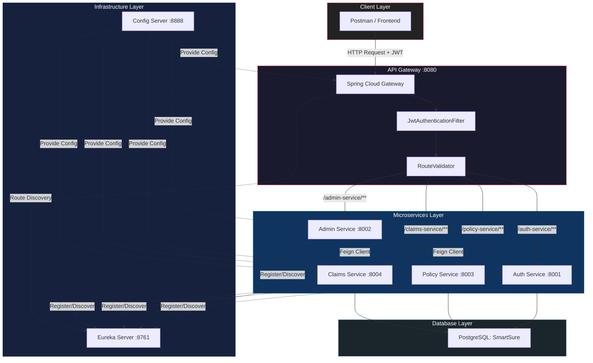
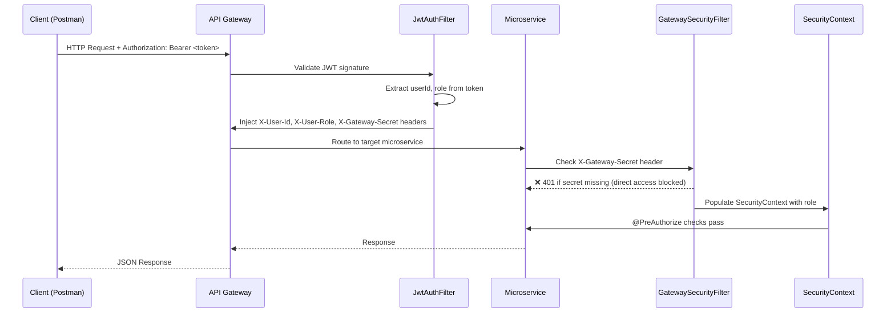
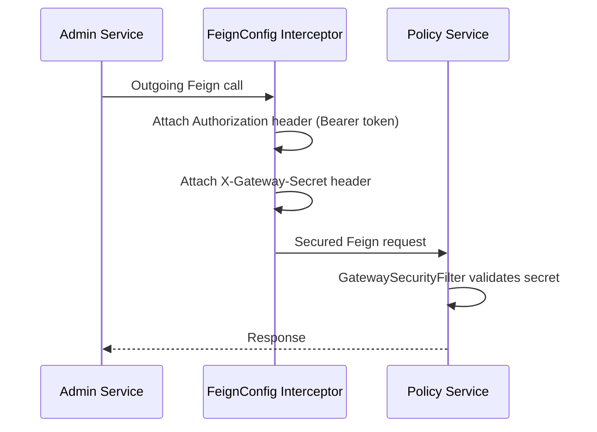

# SmartSure Insurance Management System — Architecture (HLD)

## 1. System Overview

SmartSure is a **microservices-based insurance management platform** built with Spring Boot and Spring Cloud. It supports customer registration, policy management, claims processing, and admin reporting — all secured via JWT authentication and routed through a centralized API Gateway.

---

## 2. High-Level Architecture Diagram

---

## 3. Component Summary

| Component | Port | Technology | Purpose |
|---|---|---|---|
| **API Gateway** | 8080 | Spring Cloud Gateway | Single entry point, JWT validation, header injection, routing |
| **Eureka Server** | 8761 | Spring Cloud Netflix Eureka | Service discovery and registration |
| **Config Server** | 8888 | Spring Cloud Config | Centralized configuration management |
| **Auth Service** | 8001 | Spring Boot + Spring Security | User registration, login, JWT generation |
| **Admin Service** | 8002 | Spring Boot + OpenFeign | Policy CRUD, claim review, reports (orchestrator) |
| **Policy Service** | 8003 | Spring Boot + JPA | Policy catalog, policy purchasing, policy stats |
| **Claims Service** | 8004 | Spring Boot + JPA | Claim initiation, document upload, claim lifecycle |

---

## 4. Request Flow

---

## 5. Security Architecture

### Multi-Layer Security Model

| Layer | Mechanism | Purpose |
|---|---|---|
| **Layer 1: Gateway** | `JwtAuthenticationFilter` | Validates JWT, extracts role/userId, injects custom headers |
| **Layer 2: Network** | `GatewaySecurityFilter` (in each service) | Blocks direct access via microservice ports using `X-Gateway-Secret` |
| **Layer 3: Application** | `HeaderAuthenticationFilter` / `JwtFilter` | Populates Spring `SecurityContext` with user role |
| **Layer 4: Method** | `@PreAuthorize` annotations | Fine-grained access control (e.g., ADMIN-only, owner-only) |

### Inter-Service Communication Security

---

## 6. Technology Stack

| Category | Technology |
|---|---|
| **Language** | Java 17 |
| **Framework** | Spring Boot 3.x |
| **API Gateway** | Spring Cloud Gateway |
| **Service Discovery** | Spring Cloud Netflix Eureka |
| **Configuration** | Spring Cloud Config Server |
| **Inter-Service Comm** | Spring Cloud OpenFeign |
| **Authentication** | JWT (jjwt library) |
| **Authorization** | Spring Security + @PreAuthorize |
| **Database** | PostgreSQL |
| **ORM** | Spring Data JPA / Hibernate |
| **Resilience** | Spring Retry (@Retryable) |
| **Logging** | Spring AOP (LoggingAspect) |
| **API Docs** | Springdoc OpenAPI (Swagger UI) |
| **Build Tool** | Maven |
