# SmartSure Insurance Management System — Low-Level Design (LLD)

## 1. Class Diagrams

### 1.1 Auth Service

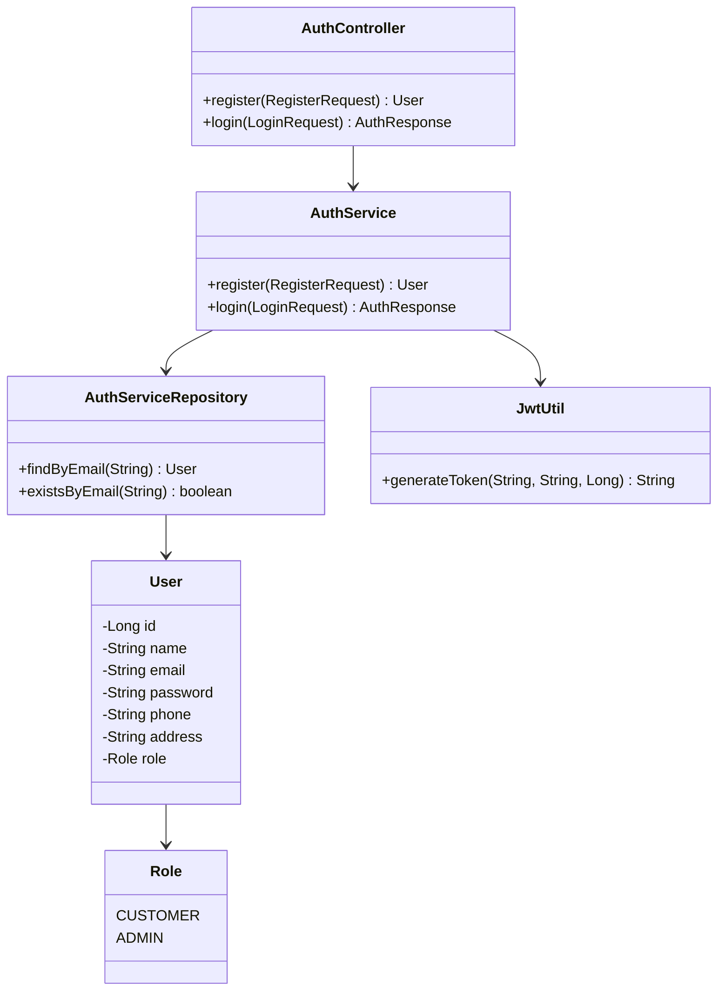

### 1.2 Policy Service

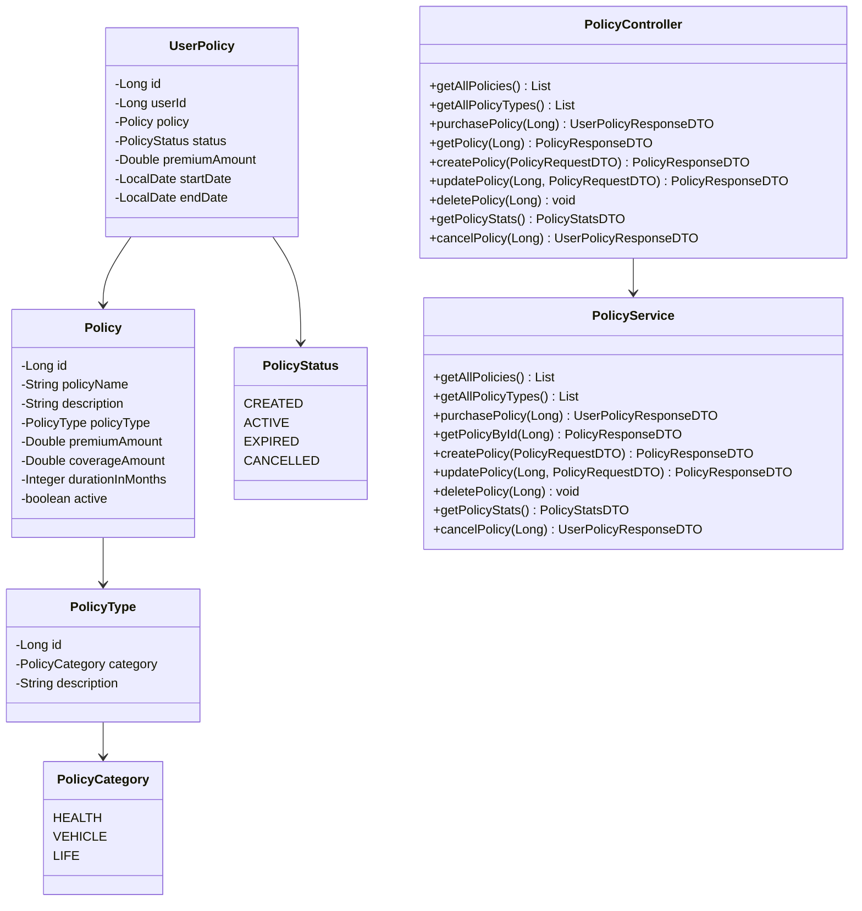

### 1.3 Claims Service

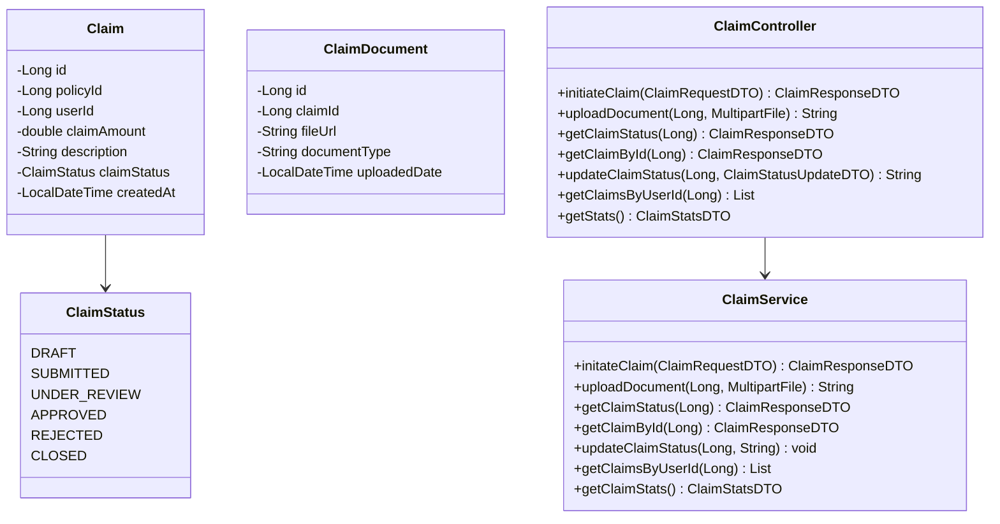

### 1.4 Admin Service

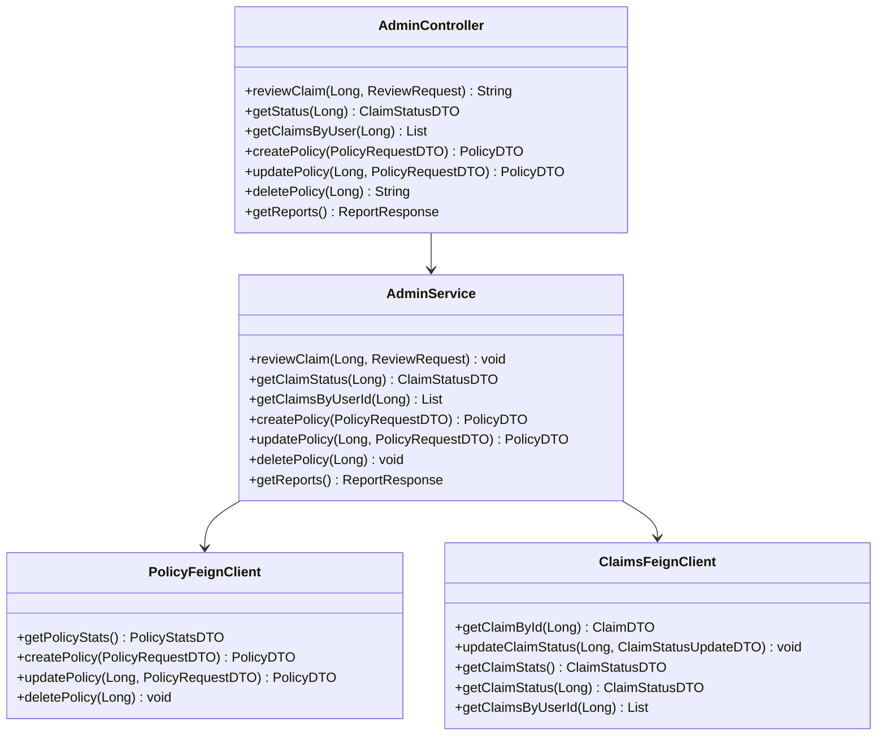

### 1.5 API Gateway

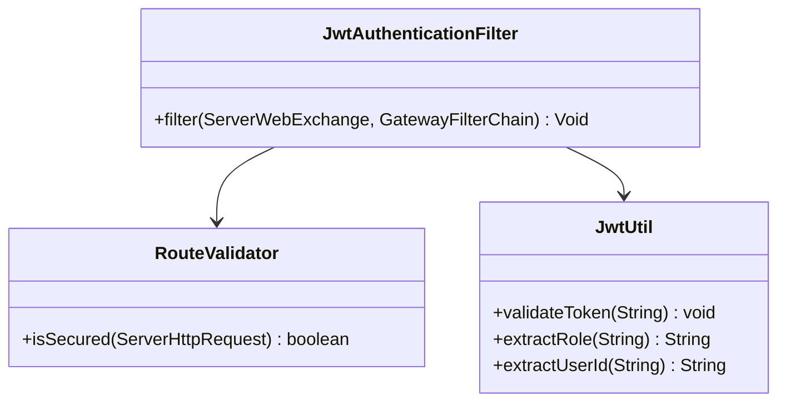

---

## 2. Sequence Diagrams

### 2.1 User Registration & Login

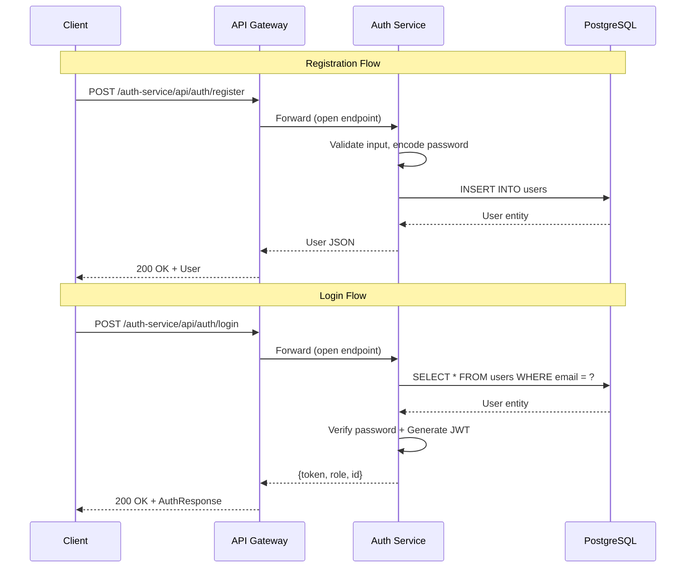

### 2.2 Admin Creates a Policy (Inter-Service via Feign)

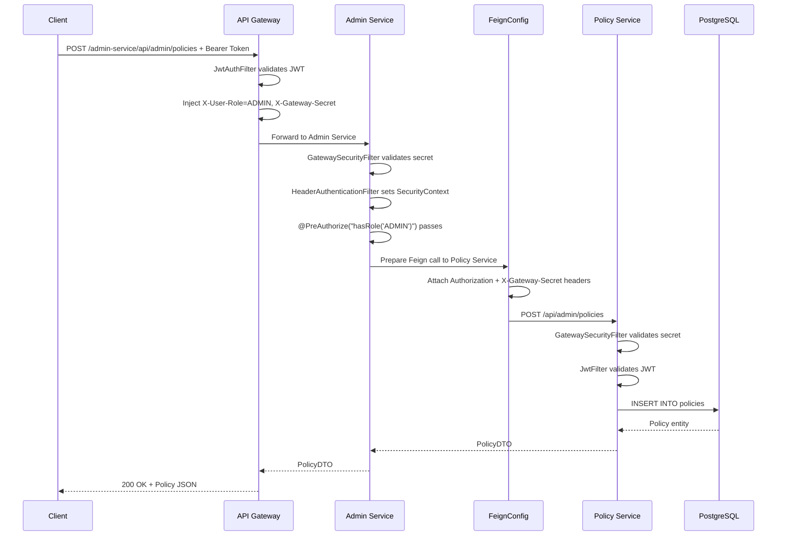

### 2.3 Customer Purchases a Policy

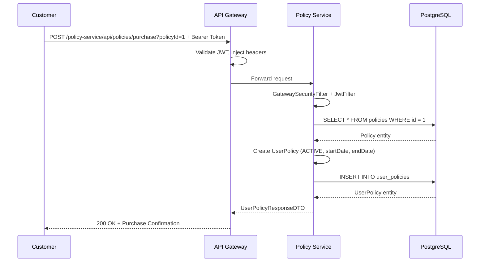

### 2.4 Claim Lifecycle (Submit → Review → Approve)

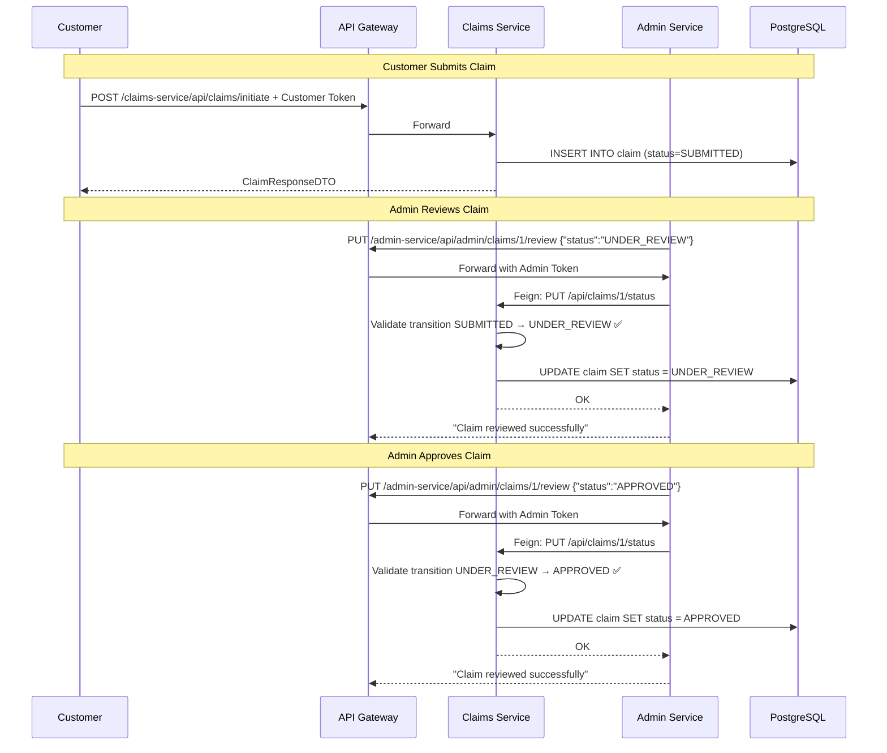

### 2.5 Admin Report Generation (Aggregated Feign Calls)

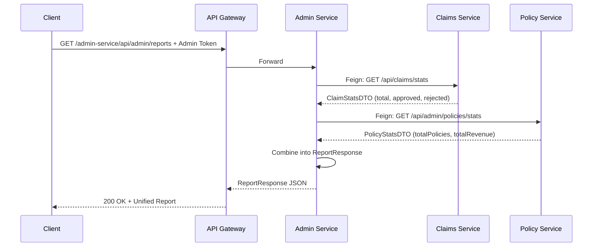

---

## 3. Claim Status Lifecycle (State Machine)

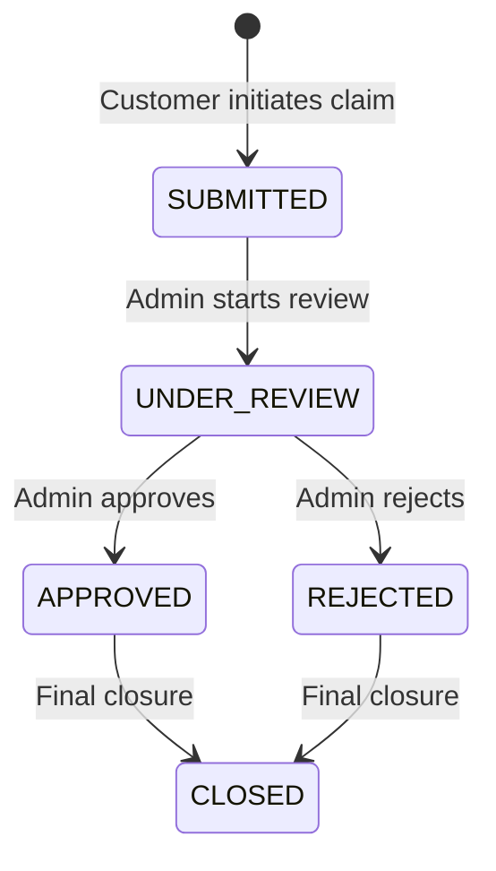

## 4. Policy Status Lifecycle (State Machine)

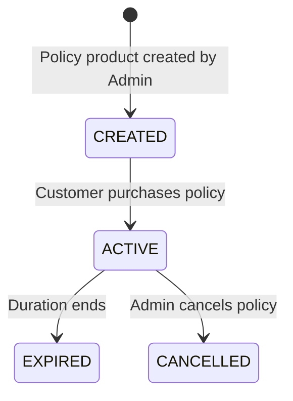
