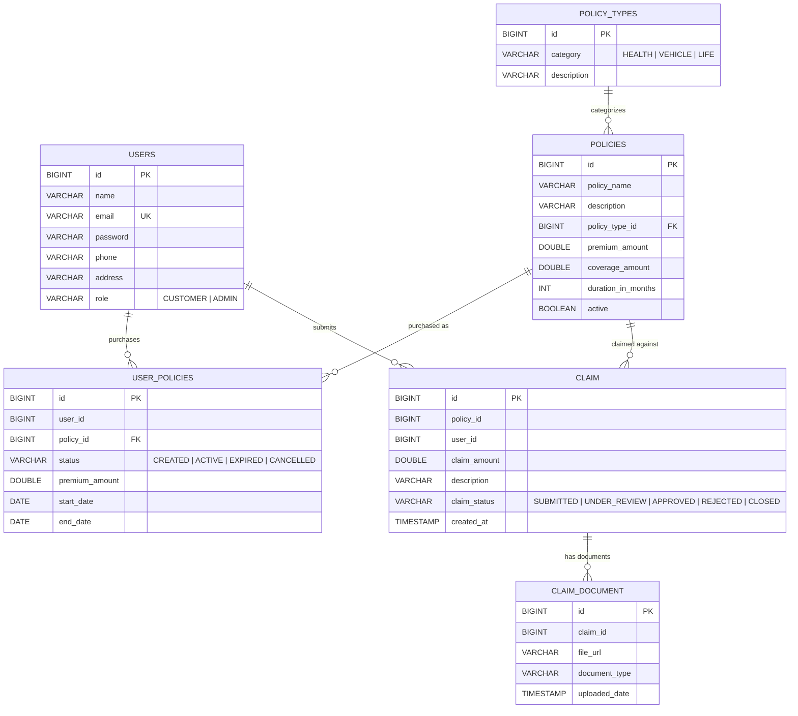

# SmartSure Insurance Management System — Database Design

## 1. Overview

SmartSure uses a **single PostgreSQL database** (`SmartSure`) shared across three data-owning microservices. Each service manages its own tables and does not directly query another service's tables — inter-service data access happens exclusively through Feign REST calls.

> [!NOTE]
> The `admin-service` does **not** own any database tables. It is a pure orchestrator that delegates to `policy-service` and `claims-service` via Feign Clients.

---

## 2. Entity-Relationship Diagram

---

## 3. Table Definitions

### 3.1 `users` (Auth Service)

| Column | Type | Constraints | Description |
|---|---|---|---|
| `id` | BIGINT | PK, AUTO_INCREMENT | Unique user ID |
| `name` | VARCHAR | NOT NULL | Full name |
| `email` | VARCHAR | NOT NULL, UNIQUE | Login email |
| `password` | VARCHAR | NOT NULL | BCrypt-encoded password |
| `phone` | VARCHAR | — | Phone number |
| `address` | VARCHAR | — | Residential address |
| `role` | VARCHAR | NOT NULL | Enum: `CUSTOMER`, `ADMIN` |

---

### 3.2 `policy_types` (Policy Service)

| Column | Type | Constraints | Description |
|---|---|---|---|
| `id` | BIGINT | PK, AUTO_INCREMENT | Unique type ID |
| `category` | VARCHAR | NOT NULL | Enum: `HEALTH`, `VEHICLE`, `LIFE` |
| `description` | VARCHAR | — | Human-readable description |

---

### 3.3 `policies` (Policy Service)

| Column | Type | Constraints | Description |
|---|---|---|---|
| `id` | BIGINT | PK, AUTO_INCREMENT | Unique policy product ID |
| `policy_name` | VARCHAR | — | Display name of the policy |
| `description` | VARCHAR | — | Policy details |
| `policy_type_id` | BIGINT | FK → `policy_types.id` | Category reference |
| `premium_amount` | DOUBLE | — | Monthly/annual premium |
| `coverage_amount` | DOUBLE | — | Maximum coverage |
| `duration_in_months` | INT | — | Policy duration |
| `active` | BOOLEAN | — | Whether the product is available |

---

### 3.4 `user_policies` (Policy Service)

| Column | Type | Constraints | Description |
|---|---|---|---|
| `id` | BIGINT | PK, AUTO_INCREMENT | Unique purchase ID |
| `user_id` | BIGINT | — | Reference to `users.id` (cross-service) |
| `policy_id` | BIGINT | FK → `policies.id` | The purchased policy product |
| `status` | VARCHAR | — | Enum: `CREATED`, `ACTIVE`, `EXPIRED`, `CANCELLED` |
| `premium_amount` | DOUBLE | — | Premium paid at purchase time |
| `start_date` | DATE | — | Coverage start date |
| `end_date` | DATE | — | Coverage end date |

---

### 3.5 `claim` (Claims Service)

| Column | Type | Constraints | Description |
|---|---|---|---|
| `id` | BIGINT | PK, AUTO_GENERATED | Unique claim ID |
| `policy_id` | BIGINT | — | Reference to `policies.id` (cross-service) |
| `user_id` | BIGINT | — | Reference to `users.id` (cross-service) |
| `claim_amount` | DOUBLE | — | Requested claim amount |
| `description` | VARCHAR | — | Claim reason |
| `claim_status` | VARCHAR | — | Enum: `DRAFT`, `SUBMITTED`, `UNDER_REVIEW`, `APPROVED`, `REJECTED`, `CLOSED` |
| `created_at` | TIMESTAMP | — | Submission timestamp |

---

### 3.6 `claim_document` (Claims Service)

| Column | Type | Constraints | Description |
|---|---|---|---|
| `id` | BIGINT | PK, AUTO_GENERATED | Unique document ID |
| `claim_id` | BIGINT | — | Reference to `claim.id` |
| `file_url` | VARCHAR | — | Filename / URL of uploaded document |
| `document_type` | VARCHAR | — | MIME type (e.g., `image/png`) |
| `uploaded_date` | TIMESTAMP | — | Upload timestamp |

---

## 4. Data Ownership Matrix

| Table | Owning Service | Accessed By |
|---|---|---|
| `users` | Auth Service | Auth Service only |
| `policy_types` | Policy Service | Policy Service only |
| `policies` | Policy Service | Policy Service, Admin Service (via Feign) |
| `user_policies` | Policy Service | Policy Service, Admin Service (via Feign) |
| `claim` | Claims Service | Claims Service, Admin Service (via Feign) |
| `claim_document` | Claims Service | Claims Service only |

---

## 5. Cross-Service References

Since this is a microservices architecture, tables do **not** have actual foreign key constraints across service boundaries. Instead, they store IDs that reference data in other services:

| Field | In Table | References | Resolved Via |
|---|---|---|---|
| `user_policies.user_id` | Policy Service | `users.id` (Auth Service) | JWT token `userId` claim |
| `claim.policy_id` | Claims Service | `policies.id` (Policy Service) | Request body from client |
| `claim.user_id` | Claims Service | `users.id` (Auth Service) | Request body from client |
