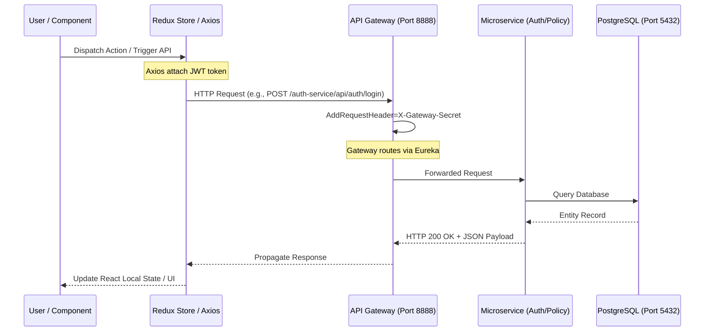

# SmartSure Frontend Technical Specification: Overview & Architecture

## 1. System Overview
SmartSure Insurance Management System is a full-stack distributed platform. The frontend operates as a React 18 / TypeScript Single Page Application (SPA), interfacing with a Spring Boot Microservices ecosystem via an API Gateway.

### Core Metrics & Specifications
* **Frontend Port:** `3000` (Vite dev server)
* **API Gateway Port:** `8888`
* **Eureka Discovery Port:** `8761`
* **Config Server Port:** `9999`
* **Axios Timeout Threshold:** `30000ms`
* **Authentication:** JWT Bearer (Access Expiry: 15min, Refresh Expiry: 7 days)

## 2. Frontend-to-Backend Connection Lifecycle
The entire request-response lifecycle between the React client and the backend follows a strict Gateway-mediated path:

## 3. High-Level Technology Data Table

| Layer | Technology | Primary Configuration Payload / Limits |
-------------|------------|-----------------------------------|
| Build | Vite | Alias `@` mapped to `./src`, Port `3000`, `host: true` |
| Client | React 18 | StrictMode enabled, Functional Component methodology |
| State | Redux Toolkit | `selectCurrentUser` abstraction, thunk-based asynchronous flow |
| Networking | Axios | `BASE_URL=http://localhost:8888`, timeout `30000ms`, `Bearer` intercepted |
| Gateway | Spring Cloud | `springdoc.swagger-ui.urls` mapped for openapi, JWT validation |
| Persistence| PostgreSQL | `localhost:5432/smartsure_auth`, Hibernate DDL auto `update` |
