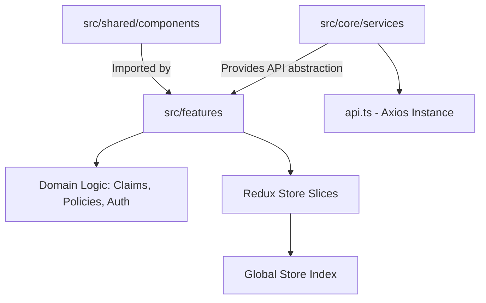

# Architecture & Code Quality Specification

## 1. Feature-First Hexagonal Architecture
The application codebase aligns with a strict feature-driven design, decoupling global shared infrastructure (`src/core`, `src/shared`) from domain-specific context (`src/features/*`).

### Directory Data Flow Visualization

## 2. API Contract & Endpoint Mapping Architecture
All network paths pass through `api.ts`, which segregates requests. Below is the mapping for core architectural modules.

### Component to Backend API Contract

| Domain Component | Method | Gateway Endpoint | Request Payload Example | Expected Response |
|------------------|--------|------------------|-------------------------|-------------------|
| `Login.tsx` | POST | `/auth-service/api/auth/login` | `{email, password}` | `200 OK`, `{token, refreshToken}` |
| `MyPolicies.tsx` | GET | `/policy-service/api/policies/user/{id}` | `userId` param | `200 OK`, `Array<Policy>` |
| `MyClaims.tsx` | POST | `/claims-service/api/claims/initiate` | `FormData` (claim, files) | `201 Created` |

## 3. Component Props Architectural Standard
Standardized interfaces govern component usage across the app.

| Component Name | Prop Interface | Description | Default |
|----------------|----------------|-------------|---------|
| `PageHeader` | `{ title: string, subtitle?: string, action?: ReactNode }` | Renders top layout | N/A |
| `Card` | `{ children: ReactNode, hoverable?: boolean }` | Data container | false |
| `StatCard` | `{ label: string, value: string, color: string }` | Displays metrics | N/A |

All components leverage strict generic inputs enforcing compile-time safety across development pipelines.
