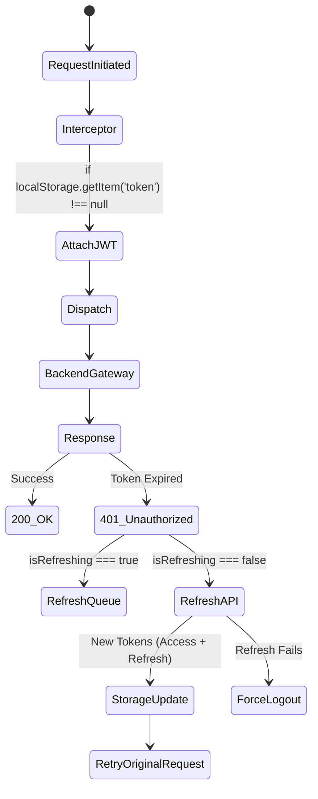

# API Integration & Data Handling Specification

## 1. Axios Orchestration Flow
`src/core/services/api.ts` constructs the absolute backbone of the frontend logic. A standard timeout of `30000ms` bounds all requests to `http://localhost:8888`.

## 2. Axios Implementation Metrics & Setup
The API service distinguishes between specific authentication needs through multiple Axios instances:

| Axios Instance | Target Base URL | Authorization Header Context | Timeout Execution |
|---|---|---|---|
| `API` | `http://localhost:8888` | `Bearer <ACCESS_TOKEN>` | `30000ms` |
| `AUTH_FREE_API` | `http://localhost:8888` | None | None |
| `INTERNAL_AUTH` | `http://localhost:8888` | Used via token query param logic | None |

## 3. Form Data and File Payload Handling
For `claimsAPI.uploadDocument`:
- Max Upload Buffer relies on standard Spring Server limits.
- Requires explicit `String(claimId)` casting logic implemented directly in the frontend since `FormData` demands primitive string payloads.
- Payload headers are overridden via `headers: { 'Content-Type': 'multipart/form-data' }`.
