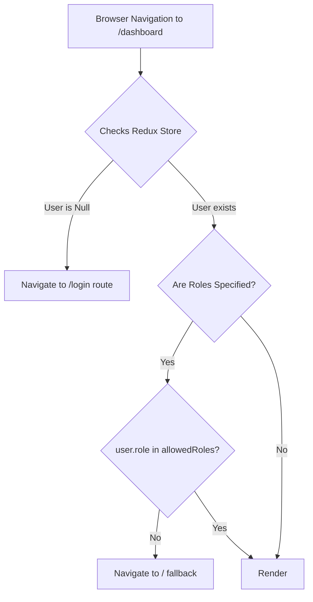

# Authentication & Authorization Technical Specification

## 1. Security Protocol & Token Strategy
Authentication is executed via JWT (JSON Web Tokens). Tokens possess specific TTL (Time-to-Live) values hardcoded in the backend `JwtUtil` configurations.

### Security Payload Metrics
* **Access Token TTL:** `15 Minutes` (`1000L * 60 * 15`)
* **Refresh Token TTL:** `7 Days` (`1000L * 60 * 60 * 24 * 7`)
* **Key Encryption Standard:** HMAC-SHA256 (`SignatureAlgorithm.HS256`)
* **User Roles:** `ADMIN` | `CUSTOMER`

## 2. Protected Route Logic Lifecycle
The frontend utilizes a `ProtectedRoute` wrapper guarding component execution.

## 3. JWT Refresh & Fallback Map
In the event of an access token hitting the 15-minute expiry, the Axios auto-refresh middleware locks upcoming queries internally in `failedQueue`. Once the backend `/auth-service/api/auth/refresh-token?refreshToken=<TOKEN>` endpoint returns HTTP 200, the updated token bypasses the queue returning execution.
If a `403` error propagates, the `forceLogout()` execution sequentially clears `localStorage.clear()` and initiates `window.location.href = '/login'`.
