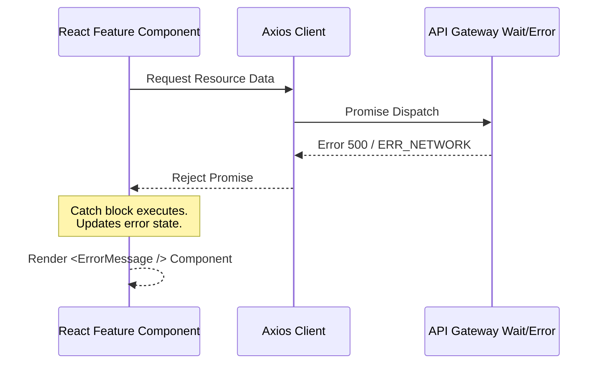

# Error Handling & Resilience Specification

## 1. Fallback & Fault Tolerance Execution
The application guards against arbitrary crashes via the overarching `GlobalErrorBoundary`. When component stack boundaries parse an inner React-thrown error state, the DOM flips rendering execution to avoid the infamous blank white screen behavior.

### System Crash Lifecycles

## 2. Universal Status Code Handlers

| Code Received | Internal Handling Mechanism | UI Render Result |
|---|---|---|
| `401 Unauthorized` | Handled silently by Axios Interceptor's `refresh` function. | No user disruption unless `refresh` fails. |
| `403 Forbidden` | Denied API access. Axios intercepts, drops promise execution. | Usually handled via `toast.error('Access Denied')`. |
| `500 Internal Error` | Trapped within logical `catch (err)` component structures. | Renders `<ErrorMessage message={err} />` |
| `ERR_NETWORK` | Identifies Gateway disconnects (Port 8888 down). | UI triggers full fallback state advising "Service Unavailable". |

## 3. Fallback UI Component Integration
`<ErrorMessage />` parameters directly rely on these specific props:
* `message` (`string`): The propagated backend error payload.
* `onRetry` (`Function`): Safely executes asynchronous REST hooks allowing manual retry processing post-gateway failure context mappings.
