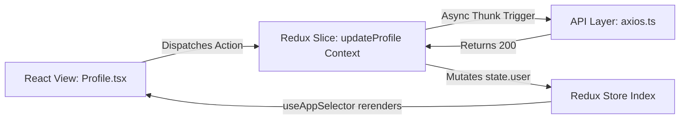

# Global & Local State Management Technical Architecture

## 1. Redux Store Implementation
The global context resolves complex domain logic through `@reduxjs/toolkit`. The architecture prevents prop drilling while maximizing performance through targeted selector mappings.

### Redux Architecture Flow

## 2. Slice Map Contracts

| Slice Name | Primary Purpose | State Shape Interface | Selectors Provided |
|------------|-----------------|-----------------------|--------------------|
| `authSlice` | JWT / Session tracking | `{ user: UserPayload, token: String }` | `selectCurrentUser`, `selectIsAuth` |
| `themeSlice`| UI Dark/Light Config | `{ mode: 'dark' \| 'light' }` | `selectCurrentTheme` |

## 3. Local State Constraints
* **`useState` Rule:** Used exclusively for ephemeral UI mutations (e.g., `<Modal isOpen={true} />`, `<input onChange={e => setText(e.target.value)} />`).
* **`useReducer` Rule:** Triggered locally for complex local state trees where multi-variable changes occur in parallel, bypassing the need for a global Redux namespace constraint.

Redux slices strictly define typed outputs reducing runtime crashes stemming from `undefined` payload states common in standard component props polling.
