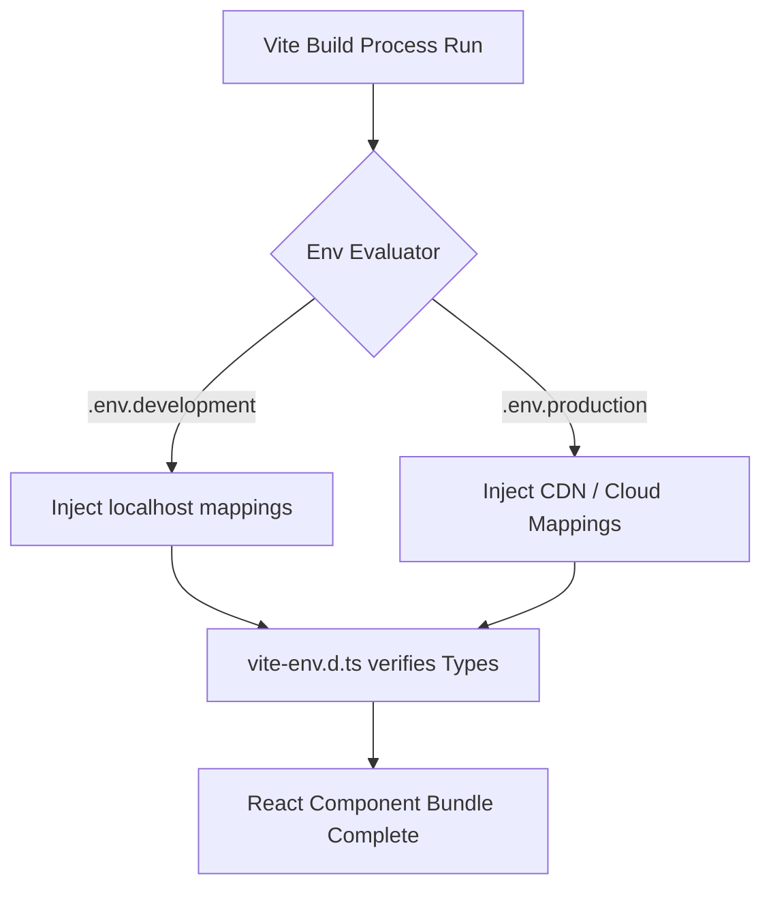

# Environment & Configuration Technical Blueprint

## 1. Vite Environment Architecture
Environment mapping decouples sensitive API gateways constraints. All `.env` executions use Vite's standard runtime injection protocols via `import.meta.env`.

### Core Application Variables Contract

| Key Name | Description | Default Development Value | Target Pipeline Concept |
|----------|-------------|----------------------------|-------------------------|
| `VITE_API_BASE_URL` | Microservices Gateway Route | `http://localhost:8888` | Maps to AWS/Azure Gateway |
| `VITE_RAZORPAY_KEY` | Transaction Identity Logic | `rzp_test_SUGz2hbfTwDAHc` | Prod Razorpay Vault ID |

## 2. Config Security Boundary
The frontend boundary strictly adheres to non-exposure constants.
The centralized `config-server` (running on `9999`) injects backend shared variables via `application.properties` including:
* PostgreSQL configuration port (`5432`)
* Microservice monitoring rules (Zipkin tracing `9411`)
* Razorpay backend verification secrets (`WtpgwgV4t3I2wTBJ22WWlDbE`). Note: Frontend ONLY requires the public `VITE_RAZORPAY_KEY`. Secret components remain strictly behind `gateway/9999` constraints.

### Execution Target Flow

