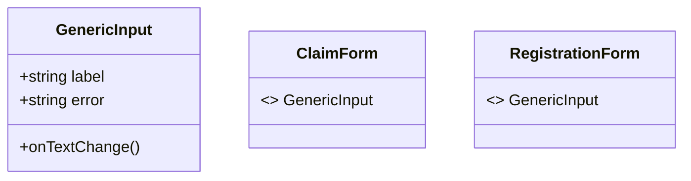

# Component Design & Reusability Contracts

## 1. Master Primitives & Atomic Design Strategy
`src/shared/components/UI.tsx` maps a specialized atomic component tree ensuring DOM efficiency. Generic React elements are abstracted away utilizing TypeScript interfaces guaranteeing compiler-level verification.

### UI Master Component Registry

| Component Signature | Inherited Props / Required Data | UX Target Utilization |
|---------------------|---------------------------------|-----------------------|
| `Button.tsx` | `variant: 'primary' \| 'danger', loading: boolean` | Resolves scaling buttons handling network queue status. |
| `Modal.tsx` | `isOpen: boolean, onClose: function, size: 'sm'\|'lg'` | Top-level z-index interceptor with opacity-background processing. |
| `StatCard.tsx` | `icon: IconType, value: string, color: hex` | Analytical metric injection primarily inside `Dashboard.tsx`. |

## 2. Reusability Data Processing Logic
When integrating forms across differing modules (`Register.tsx` vs `InitiateClaim.tsx`), the overarching visual fields execute from `<Input />` scaling Tailwind CSS variants automatically. 

Components avoid defining local overriding `style` tags and default explicitly to global CSS variables (e.g., `--color-surface` and `--color-text`) defined within `index.css`.
