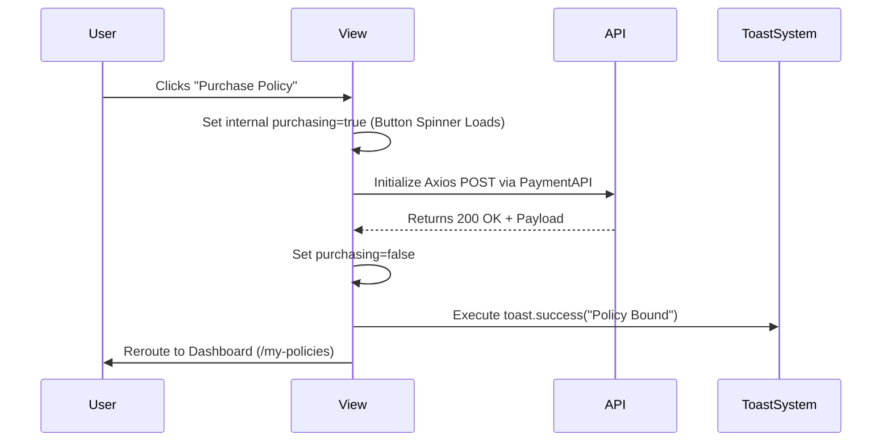

# UX & Interaction Logic Blueprint

## 1. Framer Motion Integration Standard
A strict subset of `framer-motion` APIs controls visual behavior loops to enhance perceived software speed without blocking standard React hydration events.

### Standardized Interaction Specifications

| Interaction Goal | CSS Class / Framer Tool | Data Driven Standard |
|------------------|-------------------------|----------------------|
| Initial Component Load | `<motion.div>` `fadeUp` | `transition={{ duration: 0.55, ease: [0.22, 1, 0.36, 1] }}` |
| State Staggering | `<motion.div>` `staggerChildren` | `transition: { staggerChildren: 0.09 }` |
| Button Processing | `<Button loading={true}>` | Renders infinite DOM spinner overriding inner text label dynamically. |

## 2. UX Reaction Pipeline
The interface bridges backend latency processing using predictive skeleton rendering alongside `react-hot-toast` injections resolving API confirmation events.

## 3. DOM Validation Interactions
`<Input />` and `<Select />` triggers dynamically render deep-red text mapping invalid parameter objects directly below the target form, shifting the Flexbox layout seamlessly downwards (0 layout disruptions) instead of pushing absolute alerts blocking UX interfaces.
