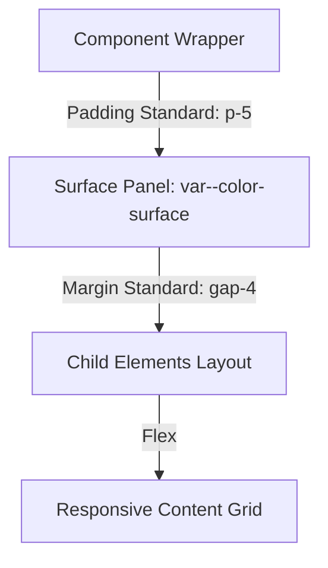

# UI Design & Visual Quality Specification

## 1. Global CSS Registry Alignment
Typography and coloration leverage exact variable mappings registered directly within `src/styles/index.css`. All components bind to these tokens bypassing direct HEX definitions ensuring multi-theme compliance dynamically.

### Core Hexadecimal Color Metrics

| Variable Name | Hex (Light) Target | Hex (Dark) Target | Functional Application Boundary |
|---------------|--------------------|-------------------|---------------------------------|
| `--color-primary` | `#6366f1` (Indigo 500) | `#818cf8` (Indigo 400) | Form boundaries, Primary CTA buttons |
| `--color-bg` | `#f8fafc` | `#0f172a` | Universal application wrapper (Root background) |
| `--color-surface` | `#ffffff` | `#1e293b` | Card container layers, top-level drop shadows |
| `--color-text` | `#0f172a` | `#f1f5f9` | Headline variables and `h1-h6` tag mapping |

## 2. Visual Structure Processing
Tailwind configuration binds to an 8-point baseline grid methodology scaling spatial definitions appropriately across DOM components format. 

## 3. Dark Mode CSS Interventions
DOM level transitions (`.dark` application state) executes a sweeping `.transition-colors .duration-300` override. The system seamlessly inverts boundaries preventing the "light mode flash" rendering anomalies frequently experienced in delayed hydration environments. `glass` morphism overlays maintain transparency scaling `rgba(30, 41, 59, 0.7)` respectively preventing opacity conflicts inside nested modulations.
