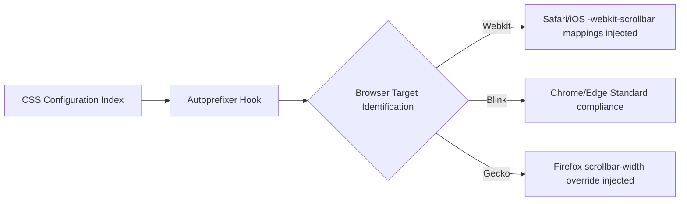

# Responsiveness & Cross-Browser Specification

## 1. Responsive Breakpoint Mapping Architecture
The application layout utilizes Tailwind's fluid dimension breakpoints prioritizing small screens out of the box. DOM width metrics drive the interface transitions.

### Baseline Viewport Thresholds

| Tailwind Prefix | Target Viewport Pixel Size (px) | Interface Action Trigger |
|-----------------|---------------------------------|--------------------------|
| Default (none) | `< 640px` (Mobile Native) | Triggers bottom navigation tab spacing; Cards map width 100%. |
| `sm:` | `>= 640px` (Large Mobile / Small Tablet) | Begins aligning dual-column statistics components. |
| `md:` | `>= 768px` (Standard Tablet) | Sidebar rendering constraints established for Admin Dashboards. |
| `lg:` | `>= 1024px` (Desktops / Laptops) | Overwrites grid boundaries enforcing multi-column layout flows. |

## 2. Rendering Disruption Mitigations
Browser logic natively executes differing CSS specification constraints resulting in rendering anomalies (e.g. nested scrolling logic on legacy devices).

To resolve specifically Apple iOS Safari "bottom safe area" obstruction events when dealing with bottom navigation bars, specific `.tab-spacer` div components inject `72px` of bottom breathing DOM block clearance forcing viewport conformity.
