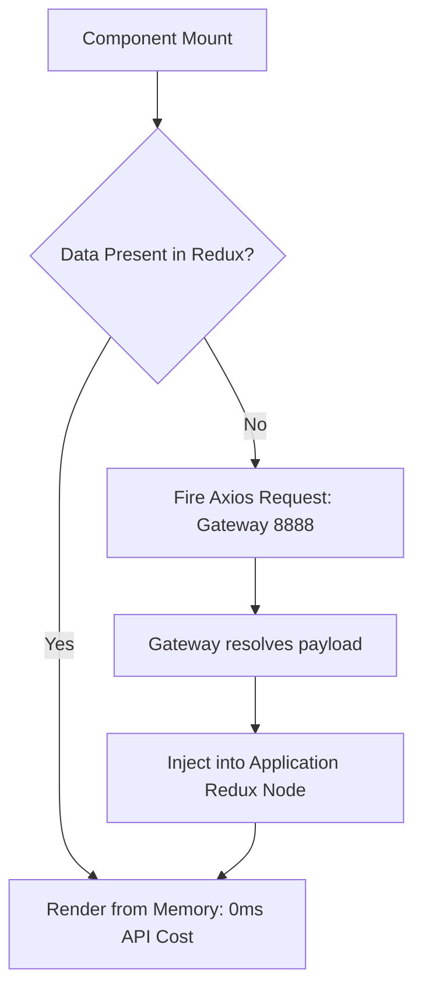

# Performance Optimization Technical Spec

## 1. Vite Build-Cycle Optimization
The V9 Application transitions completely away from Webpack dependency graphs, driving performance aggressively upwards via Native ES Module loading inside Vite on Port `3000`.

### Core Bundle Compilation

| Metric Type | Measurement Component | Configuration Parameter |
|-------------|-----------------------|-------------------------|
| Compilation Engine| `esbuild` | Core default - Native Go compilation bindings |
| Final Rollup Target | `dist/` | Tree-shaken production Javascript chunk bundles |
| Memory Limits | Node execution env | Standard V8 max_old_space metrics apply |

## 2. React Runtime Network Efficiency
Network request mapping explicitly suppresses multiple overlapping payload requests occurring from component mount lifecycles.

## 3. DOM Paint Operations
Heavy SVGs rendering multi-layer graphic elements, especially the donut charts (`<ChartDonut />` in UI.tsx), bypass heavy canvas rendering loads by utilizing lightweight SVG stroke offsets executed entirely via CSS transition calculations instead of constant JavaScript polling algorithms.
