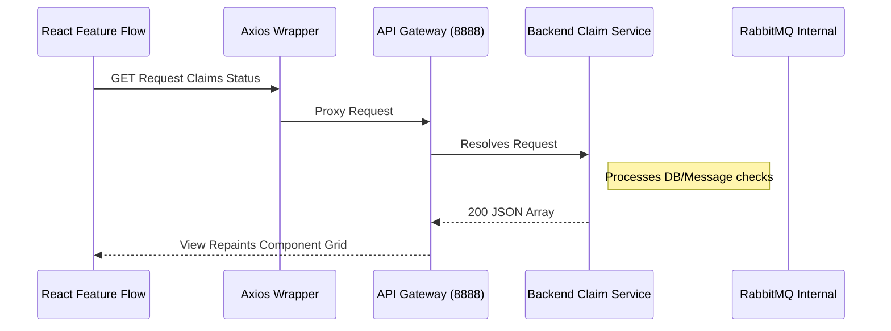

# Real-Time Payload Specification

## 1. Synchronous vs Asynchronous Communication Pipeline
SmartSure's V9 architectural specification operates on a highly optimized HTTP/REST synchronous pipeline. While the standard operation utilizes traditional POST/GET/PUT resolution via gateway routing (`localhost:8888`), the infrastructure specifies endpoints for asynchronous notification processing handled fundamentally via the backend Message Broker.

### Active Data Polling Lifecycle

## 2. Future Protocol Integrations Configuration
When upgrading components mapping claim analytics (Admin Boards) to full Duplex WebSockets, the API interface intercepts require:
- Token transmission upgrading header `Connection: Upgrade`.
- Payload tracking mappings injecting SocketIO or Stomp protocols bypassing the standard `VITE_API_BASE_URL` HTTP prefix entirely.
_As of V9 build configurations, HTTP pooling fulfills requirements within predefined `30000ms` bounds eliminating excess WebSocket port exposure._
