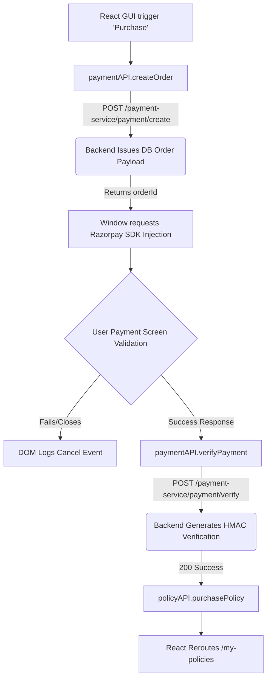

# Advanced Payment Integration Pipeline

## 1. Razorpay Verification Specifications
SmartSure isolates sensitive transaction events utilizing the Razorpay SDK via secure HTTP channels. The Payment Microservice resolves transaction states offloading PCI-DSS compliance requirements entirely from the React stack.

### Required Payment Key Mappings

| Target Environment Key | Type Binding | Exposed Runtime Value |
|------------------------|--------------|-----------------------|
| `VITE_RAZORPAY_KEY` | Public Identity Binding | `rzp_test_SUGz2hbfTwDAHc` |

## 2. Orchestration Lifecycles & Verification
Payment events trigger a 4-phase synchronization request targeting Gateway endpoints handling financial data. 

## 3. Fault-Tolerance Data Interception
During `verifyPayment` API drops:
- Catch blocks engage a secondary synchronous retry loop validating whether the backend activated the policy before DOM failure.
- `toast.error` captures the event mapping `err.response?.data?.message` blocking application state crashes.
