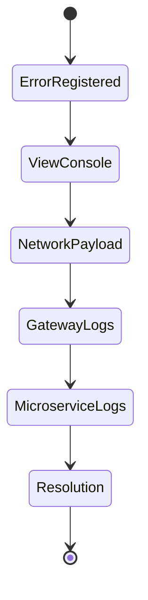

# Diagnostics & Testing Blueprint

## 1. Centralized Observability Interfaces
SmartSure incorporates external monitoring parameters specifically accessible for backend resolution testing, exposing tracking via `Prometheus` and `Zipkin` (bound locally on `9411`).

### System Metrics Dashboard Endpoints

| Target Module | Service Port | Telemetry Resolution |
|---------------|--------------|----------------------|
| Vite React DOM | `3000` | Browser Console Event Tracing |
| API Gateway | `8888` | Aggregated `/swagger-ui.html` API Checks |
| Zipkin Server | `9411` | Cross-Service API Traceability Mapping |
| Config Server | `9999` | Prometheus endpoint injection hooks |

## 2. API Contract Resolution Workflows
When React component errors populate, structured diagnostics enforce this strict fallback pipeline:

Debugging components map backend `.log` anomalies originating from `application.properties` directly into Redux catch blocks ensuring stack trace visibility directly across React DevTools inspector modules without manual `tail` processing.
