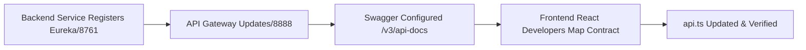

# Documentation & Maintainability Configuration

## 1. Context Encapsulation Specifications
Codebase readability inherently relies upon predictable tree definitions mapping logic boundaries. The React Single Page Application (SPA) adheres to a self-contained domain structure protecting against unintended DOM cross-contamination.

### Source Control Directory Maps

| Root Architecture Node | Compile Responsibility | Maintainability Concept |
|------------------------|------------------------|-------------------------|
| `src/core/` | Global Axio/Guard Executing | Prevents API logic polluting module-level logic. |
| `src/features/` | Scoped Module Implementation | Isolates `claim` variables completely apart from `policy`. |
| `src/shared/` | Cross-Boundary Elements | Atomic UI updates apply globally. |
| `docs/` | Static Metadata Reference | Maps implementation specs aligning to Git standards. |

## 2. API Contract Sync Standard
To maintain feature harmony alongside backend Microservice lifecycles passing `Eureka` registration logic, all mapped routes MUST exist concurrently inside Gateway Swagger arrays.

By enforcing Gateway-only routing mapping via `VITE_API_BASE_URL` (`http://localhost:8888`), local React instances drop dependency checks against randomized downstream Spring component ports.
