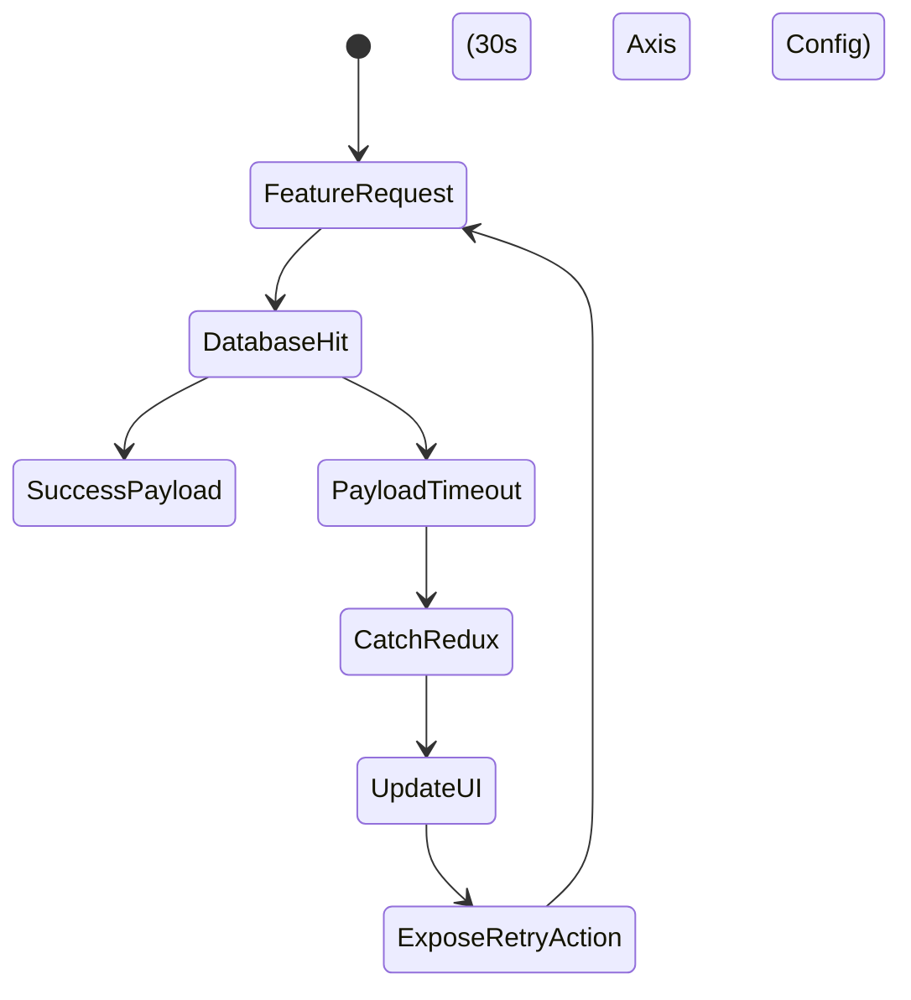

# Feature Completeness & Functional Coverage Data

## 1. Comprehensive System Use Cases
Functional coverage guarantees that all intended user lifecycles complete without error thresholds impacting session lengths. The V9 implementation bridges front-to-back processes across highly isolated operational layers.

### Role-Based Interaction Tiers

| Trigger Context | Target Backend Microservice | Authorization Level | Payload Execution |
|---------------|-------------------------|---------------------|-------------------|
| Purchase Execution | `/payment-service/` | Customer | Order ID tracking and Razorpay Validation |
| Review Claims | `/admin-service/api/admin/claims/` | Admin Only | JWT Header verification processing Data DTOs |
| Document Operations | `/claims-service/api/claims/upload` | Customer | Blob retrieval or HTTP Multipart Forms |

## 2. Process Completeness Mapping
Edge cases natively integrate into DOM behaviors overriding component states when APIs miss execution markers.

This loop ensures incomplete operations gracefully recycle rendering layers preventing "dead-ends" inside client browser execution contexts.
