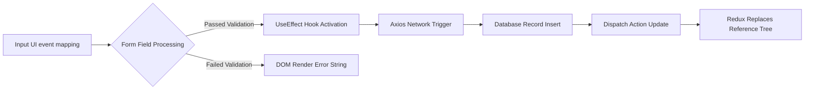

# Advanced Code Logic Integration Patterns

## 1. Structural Component Resolution Methods
SmartSure implements specialized Type-Driven Development patterns leveraging React DOM specifications bypassing loosely defined element interfaces. 

### Core React Integration Models

| Logic Element Protocol | Execution Standard | Data Reliability Goal |
|------------------------|--------------------|-----------------------|
| Generic Typing (`UI.tsx`) | Component parameter strict typing | Resolves PropType crashes natively at build time via `tsc` execution. |
| Object Deconstruction | `{ title, action } = props` | Avoids deeply nested memory addressing logic (`props.obj.data.string`). |
| Redux Memoization | Redux specific slice bindings | Connects DOM endpoints eliminating prop-drilling memory overheads. |

## 2. Data Propagation Lifecycle
Understanding the API execution flow necessitates awareness of Redux's non-mutative structure mapping events directly against memory. 

By enforcing single-direction data architectures, application memory leaks generated normally by two-way data-bindings are systematically eradicated from the system.
