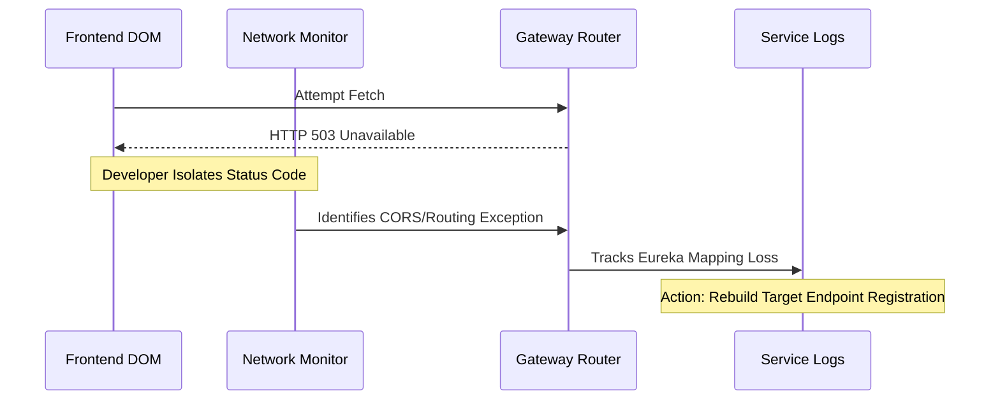

# Development Synchronization & Problem Solving

## 1. Cross-Discipline Defect Resolution Pipeline
Structured resolution formats define development communication processes mapping error events internally via the network layer directly down toward component outputs.

### Issue Triangulation Metrics

| Metric Node | Inspector Source Location | Execution Output Status |
|-------------|----------------------------|-------------------------|
| Node Compile Issue | Vite Terminal | Pre-compilation `.tsx` typescript constraint crashes. |
| DOM Event Anomaly | React DevTools Context | Prop-state manipulation mismatch identification. |
| Database Failure | Gateway HTTP Return | 500 Network payload inspection via Chrome DevTools. |

## 2. Resolution Action Map
When debugging backend communication drops (e.g., config-server on Port 9999 misconfigured mapping Eureka Discovery):

This transparency protocol blocks "shotgun debugging" by targeting explicit node execution layer failures systematically preventing downstream collateral system disruptions.
