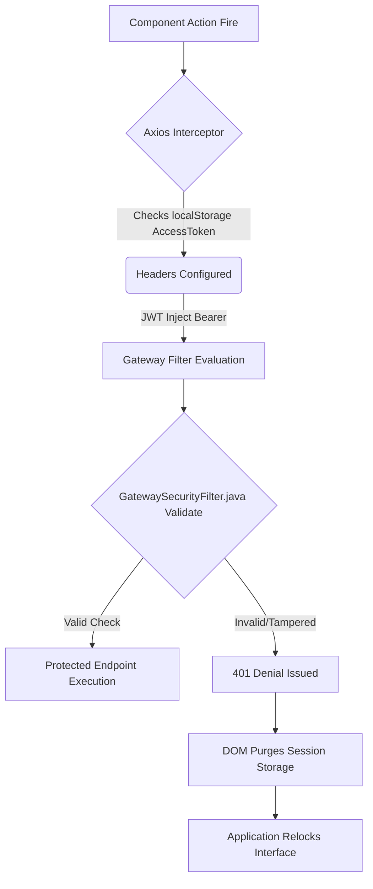

# Platform Security & Authentication Posture

## 1. Network Boundary Vulnerability Safeguards
Data interactions mandate strict cross-origin security bindings handled exclusively via Gateway filters restricting execution paths natively preventing unauthorized remote execution (RCE). Configuration parameters secure user identity validation completely on the server-side logic processors.

### Core Security Controls Base

| Vector Analyzed | Configuration Preventative Mechanism | Implementation Proofing |
|-----------------|--------------------------------------|-------------------------|
| Cross-Site Scripting (XSS) | React DOM Escaping | JSX inherently stringifies executed logic injections preventing `innerHTML` overrides. |
| Session Hijacking | Variable Token Expirations | `JwtUtil.java` overrides standard token limits executing explicit `15` minute window parameters. |
| Payment Extortion | Razorpay Dual Validation | SDK parameters execute exclusively inside secure IFrames with backend `HMAC-SHA256` payload verification. |

## 2. API Routing Security Boundary
Interceptors inject data dynamically against execution context bypassing hardcoded browser-storage queries inside components. This pattern forces all HTTP activity into a unified validation funnel.

