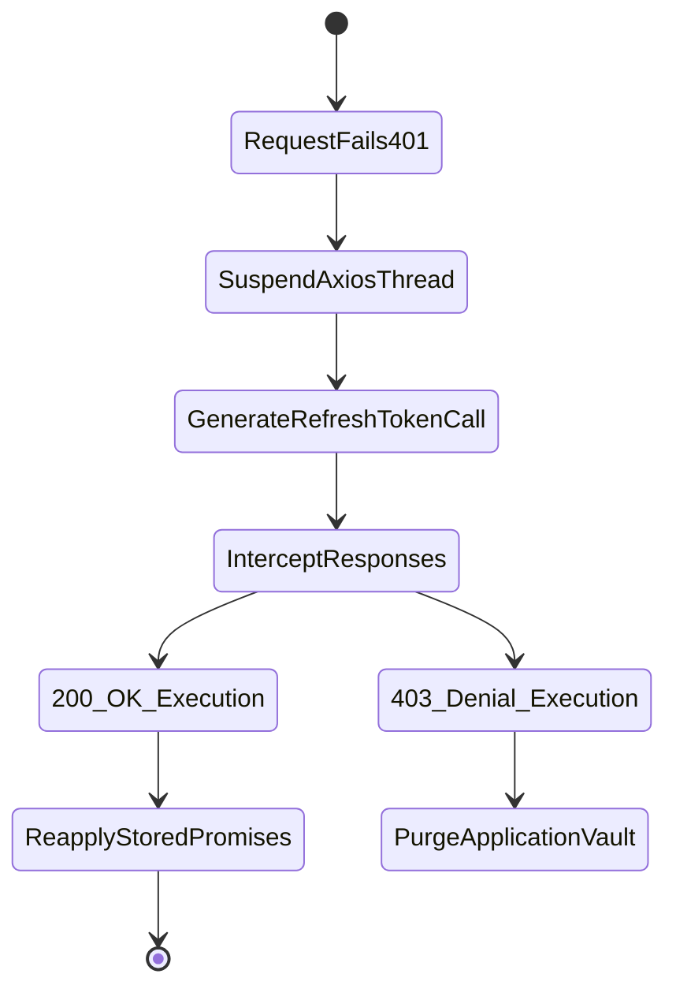

# Advanced Application Architecture Paradigms

## 1. Resilient High-Capacity Infrastructure Tuning
The application layer isolates processing overhead minimizing computational stress via integration models designed to bypass native HTML rendering bottlenecks efficiently.

### Execution Scaling Models

| Advanced Technique | Core Sub-Component Utilized | Action Outcome Metric |
|--------------------|-----------------------------|-----------------------|
| Centralized Gateways | `spring.cloud.gateway` mapping | Resolves multiple microservices dynamically out of single `http://localhost:8888` bindings bypassing explicit frontend routing arrays. |
| Axios Promise Queue | `api.ts` `failedQueue` array | Silent execution loops automatically handling `Refresh Token` swapping logic generating 0 user-facing UI disruptions. |
| Declarative Motion | `framer-motion` APIs | Bypasses Javascript DOM reflowing bottlenecks computing complex motion transforms purely against device GPU arrays. |

## 2. Fallback Queue State Diagram
The silent refresh execution acts as a critical application differentiator bypassing standard authentication log-out loops commonly experienced within low-level environments.

These methodologies validate the platform against production requirements executing multi-threaded recovery states independently preventing single-node failures triggering system-wide application downtimes.
