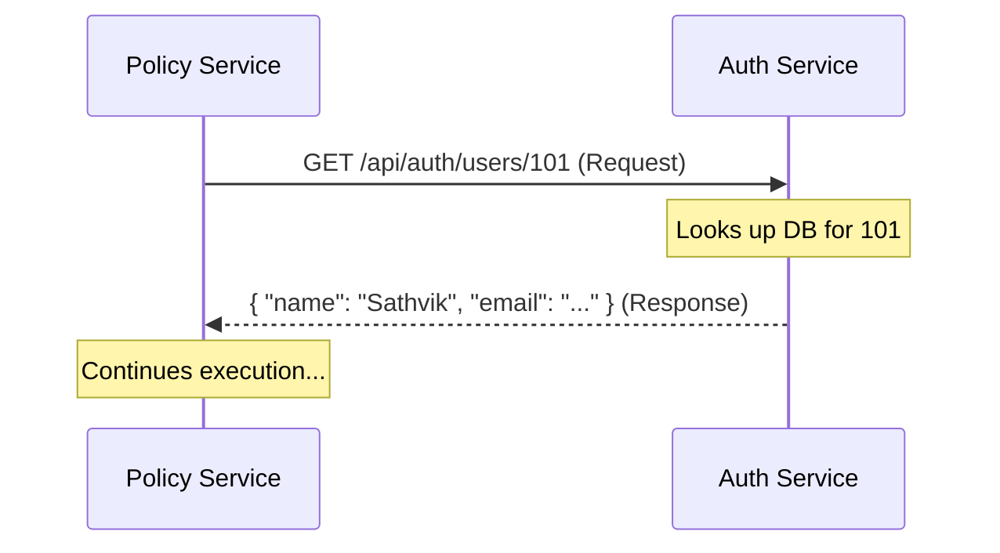

# Feign Client (Synchronous Communcation) in SmartSure

In the **SmartSure** project, we use **OpenFeign** to make microservices talk to each other **synchronously**. It allows one service to call another service as if it were just a regular Java method.

---

## 1. What is Feign Client?

Feign is a **Declarative REST Client**. 
-   **Declarative** means you just define an "Interface" and describe the URL, and Spring Boot handles the rest.
-   **Synchronous** means the service **stops and waits** for the answer (unlike RabbitMQ, which is "fire and forget").

---

## 2. Why use Feign Client?

1.  **Simplicity**: You don't have to write complex `RestTemplate` code with URLs, headers, and error handling. You just call a Java method.
2.  **Eureka Integration**: Feign automatically looks up other services (like `AUTH-SERVICE`) using our Eureka Server. You don't need to hardcode IP addresses.
3.  **Clean Code**: It keeps your business logic clean because it looks like you are calling a local service.

---

## 3. Real-World Use Case in SmartSure

### ✅ Scenario: Fetching User Data for Email
When the **Policy Service** needs to send an email, it knows the `userId`, but it doesn't know the user's `Name` or `Email`. That data lives in the **Auth Service** database.

**The Flow**:
1.  **Policy Service** calls `AuthClient.getUserById(userId)`.
2.  **Auth Service** receives the request, looks in its DB, and returns the User details.
3.  **Policy Service** receives the details and proceeds to send the notification.

---

## 4. Technical Implementation ("How it's coded")

### The Client Interface
In `AuthClient.java`:
```java
@FeignClient(name = "AUTH-SERVICE", path = "/api/auth") // Points to the other service
public interface AuthClient {
    
    @GetMapping("/users/{id}") // The REST endpoint to call
    UserDTO getUserById(@PathVariable("id") Long id);
}
```

### Using the Client
In `PolicyCommandServiceImpl.java`:
```java
// It looks like a normal local method call!
UserDTO user = authClient.getUserById(userId);
String email = user.getEmail();
```

---

## 5. Feign vs RabbitMQ (When to use which?)

| Feature | Feign Client (REST) | RabbitMQ (Messaging) |
| :--- | :--- | :--- |
| **Mode** | **Synchronous** (Wait for response) | **Asynchronous** (Fire and forget) |
| **Analogy** | A Phone Call (Interactive) | Sending a Letter (Delayed) |
| **Best For** | Getting data *now* (e.g., Fetching a user) | Triggering a task *later* (e.g., Sending email) |
| **Dependency** | Both services must be UP. | Services can be DOWN (RabbitMQ holds it). |

---

## 6. Visual Flow of Feign


