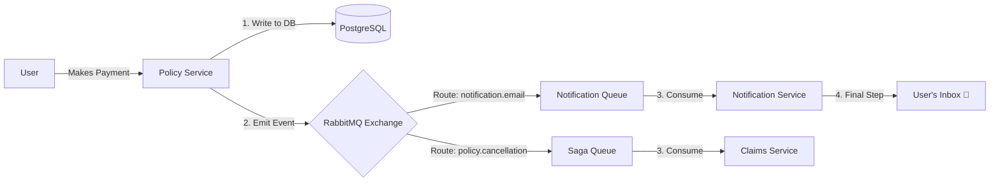

# RabbitMQ (Messaging & Events) in SmartSure

In the **SmartSure** project, we use **RabbitMQ** as our Message Broker. It acts like a digital post office, allowing different microservices to talk to each other asynchronously.

---

## 1. Why use RabbitMQ?

1.  **⚡ Instant Responsibility**: If the Policy Service had to send a real email during a payment, the user would see a loading spinner for 5 seconds. With RabbitMQ, the service just "mails a letter" and returns success immediately.
2.  **🧩 Decoupling**: The Payment logic doesn't need to know how the Email logic works. It just emits an event.
3.  **🛡️ Reliability**: If the Notification Service is temporarily down, RabbitMQ holds the messages in a **Queue**. Once the service is back, it processes them—so no customer ever misses an important email.

---

## 2. Core Concepts (The "Post Office" Analogy)

| Concept | Analogy | Description |
| :--- | :--- | :--- |
| **Producer** | The Sender | The service that sends information (e.g., Policy Service). |
| **Exchange** | The Post Office | Receives messages and decides which "Mailbox" (Queue) to put them in. |
| **Routing Key** | The Address | A label (like `notification.email`) that tells the Exchange where to send the mail. |
| **Queue** | The Mailbox | A storage area where messages wait to be picked up by a Consumer. |
| **Consumer** | The Recipient | The service that reads and acts on the message (e.g., Notification Service). |

---

## 3. Real-World Use Cases in SmartSure

### ✅ Scenario A: Payment Confirmations
When you pay a premium, a chain reaction happens:
1.  **Policy Service** updates your balance in the DB.
2.  **Policy Service** sends a "Payment Payment Event" to RabbitMQ.
3.  **RabbitMQ** routes this to the `notification.queue`.
4.  **Notification Service** picks it up and sends the actual email.

### ✅ Scenario B: The Policy Cancellation Saga 🛡️
1.  **Policy Service** initiates a cancellation and sends a `policy.cancellation` event.
2.  **Claims Service** listens for this specific event.
3.  **Claims Service** automatically rejects any active claims for that policy to prevent fraud.

---

## 4. Technical Implementation ("How it's coded")

### The Producer (Sourcing the data)
In `AsyncNotificationService.java`:
```java
// Sending the email "letter"
rabbitTemplate.convertAndSend("notification.exchange", "notification.email", event);
```

### The Consumer (Receiving the data)
In `NotificationEventListener.java`:
```java
@RabbitListener(queues = "notification.queue")
public void handleEmailNotification(NotificationEvent event) {
    // Code to send the real Email/SMS
}
```

---

## 5. Visual Messaging Flow


