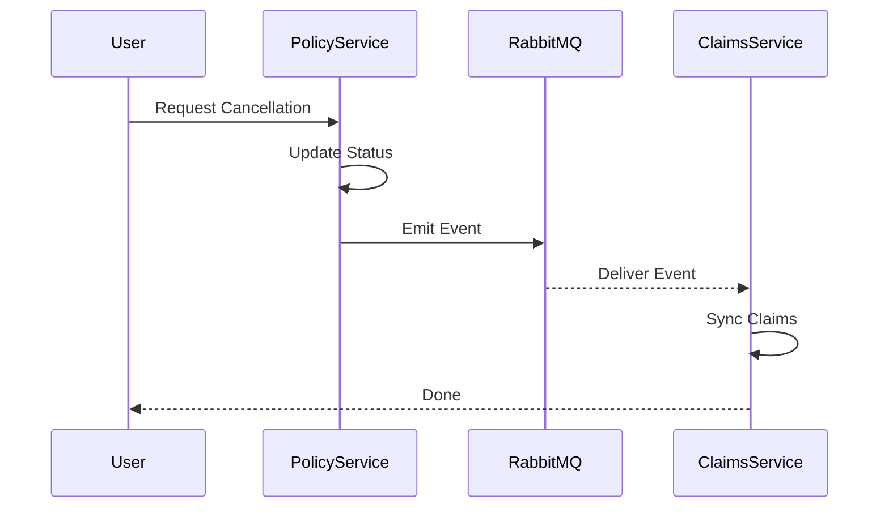

# Saga Pattern in SmartSure Insurance Management System

In a microservices architecture like **SmartSure**, ensuring data consistency across multiple services is a challenge since each service has its own independent database. The **Saga Pattern** is our solution for managing these distributed transactions effectively.

---

## 1. What is the Saga Pattern?
A Saga is a sequence of local transactions. Each local transaction updates the database and publishes a message or event to trigger the next local transaction in the sequence. 

### Key Concepts:
*   **Local Transaction**: An update performed by a single service on its own database.
*   **Compensating Transaction**: If a local transaction fails, the saga executes a series of "undo" transactions to restore the system to its original state.
*   **Choreography-based Saga**: In this project, we use choreography. There is no central "master" orchestrator; instead, services communicate by listening to each other's events via **RabbitMQ**.

---

## 2. Use Case: Policy Cancellation
The most critical implementation of the Saga pattern in SmartSure is the **Policy Cancellation flow**. 

### 🛑 The "Fraudulent Payout" Problem
In an insurance system, a dangerous "gap" occurs during a cancellation if services aren't synchronized. Imagine this timeline **without** a Saga:

1.  **10:00 AM**: A user files a claim for $5,000 (Claim Status: `PENDING`).
2.  **10:05 AM**: The user cancels their policy to get a refund.
3.  **10:06 AM**: The Policy Service marks the policy as `CANCELLED`.
4.  **10:10 AM**: An agent (unaware of the cancellation) approves the $5,000 claim because it still looks "Valid" on their screen.

**Result**: The user gets a refund **and** a $5,000 payout. The Saga pattern prevents this "double-dipping."

“If a user raises a claim and later cancels the policy, the Saga Pattern ensures consistency. When the policy cancellation is initiated, an event is published to the Claims Service, which automatically rejects any active or pending claims for that policy. As a result, the agent will see that the claim is already rejected and cannot approve it.”

Your Saga fixes this 👇

Policy cancelled → event sent
Claims Service receives event
All claims → automatically rejected

👉 So at 10:10:

Agent opens claim ❌
Status = REJECTED
Cannot approve
---

## 3. The Implementation Workflow

### 📋 Stage 1: Initiation (Policy Service)
When a user triggers a cancellation, the **Policy Service** performs its local transaction first.

*   **Action**: It changes the policy state to `PENDING_CANCELLATION`.
*   **Why "Pending"?**: We don't mark it fully cancelled yet because we need to ensure the rest of the system (Claims Service) is aware and ready.
*   **The "Shout" (Event)**: It publishes a `PolicyCancellationEvent` to the `policy.exchange` in RabbitMQ.

**Code Reference:** [`PolicyCommandServiceImpl.java`](file:///d:/smart-sure/SmartSure-Insurance-Management-System-V9/backend/policy-service/src/main/java/com/group2/policy_service/service/impl/PolicyCommandServiceImpl.java)
```java
public UserPolicyResponseDTO requestCancellation(Long upId, String reason) {
    // 1. Update local state
    up.setStatus(PolicyStatus.PENDING_CANCELLATION);
    userPolicyRepository.save(up);

    // 2. Publish Event to RabbitMQ
    rabbitTemplate.convertAndSend(
        RabbitMQConfig.POLICY_EXCHANGE, 
        RabbitMQConfig.CANCELLATION_ROUTING_KEY, 
        new PolicyCancellationEvent(up.getId(), up.getUserId(), LocalDateTime.now())
    );
    return mapper.mapToUserPolicyResponse(up);
}
```

### 📬 Stage 2: Participation (Claims Service)
The **Claims Service** acts as a subscriber, constantly watching the queue.

*   **The Trigger**: As soon as the event hits the queue, the `PolicyCancellationListener` wakes up.
*   **Local Transaction**: It executes `claimService.cancelClaimsByPolicy(policyId)`.
*   **The Search Logic**: The service searches for claims where:
    1. `policyId` matches the cancelled policy.
    2. `status` is `OPEN`, `PENDING`, or `UNDER_REVIEW`.
*   **The Switch**: It automatically switches these claims to **REJECTED** with a system note.

**Code Reference:** [`PolicyCancellationListener.java`](file:///d:/smart-sure/SmartSure-Insurance-Management-System-V9/backend/claims-service/src/main/java/com/group2/claims_service/listner/PolicyCancellationListener.java)
```java
@RabbitListener(queues = "policy.cancellation.queue")
public void handlePolicyCancellation(PolicyCancellationEvent event) {
    try {
        // Synchronize state: Reject related claims
        claimService.cancelClaimsByPolicy(event.getUserPolicyId());
        System.out.println("✅ Saga Stage 2: Claims synchronized.");
    } catch (Exception e) {
        System.err.println("❌ Saga Stage 2 Error: " + e.getMessage());
    }
}
```

---

## 4. Why Use This Pattern?

| Benefit | Description |
| :--- | :--- |
| **⚖️ Decoupling** | The Policy Service doesn't need to know how the Claims Service works. It just says "this policy is cancelling" and lets the other handle its business. |
| **🛡️ Reliability** | If the Claims Service is down, RabbitMQ holds the message. Once it's back online, it processes the cancellation automatically. No data loss. |
| **🎯 Integrity** | It ensures a "Cancelled Policy" and an "Active Claim" never exist simultaneously, maintaining **Eventual Consistency**. |

---

## 5. Sequence Diagram


*If the image above doesn't load, here is the technical Mermaid breakdown:*



---

## 6. Component Summary
| Component | Role | File Path |
| :--- | :--- | :--- |
| **Event Producer** | Initiates Saga | `policy-service/.../PolicyCommandServiceImpl.java` |
| **Message Broker** | Transport Layer | `RabbitMQ` (Configured in `RabbitMQConfig.java`) |
| **Event Consumer** | Completes Saga | `claims-service/.../PolicyCancellationListener.java` |
| **Event Object** | Data Carrier | `PolicyCancellationEvent.java` (DTO) |
